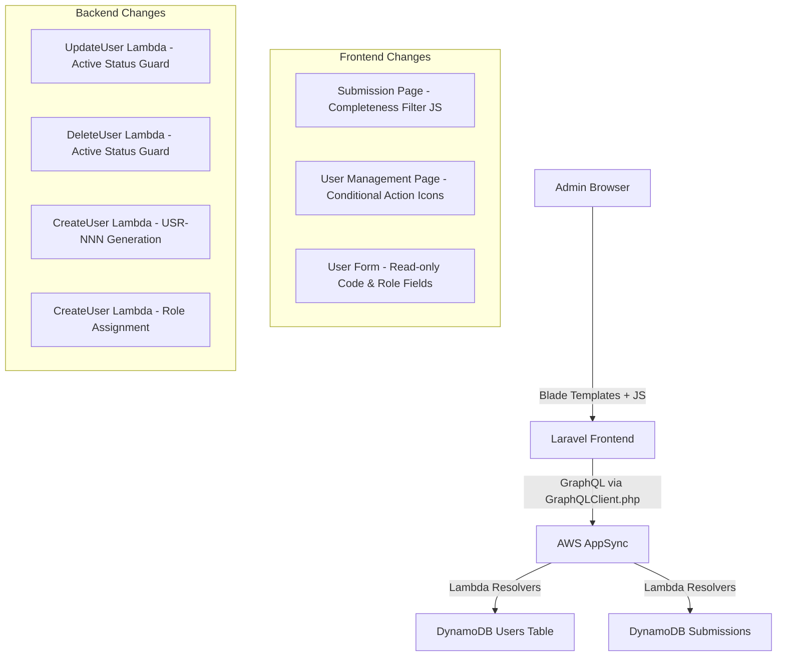

# Design Document: Admin Pages Enhancements

## Overview

This design covers four enhancements to the TimeFlow admin pages:

1. **Timesheet Submission Completeness Filter** — A client-side filter on the Submission Page allowing admins to view All, Complete (≥40h), or Incomplete (<40h) submissions.
2. **Restrict Actions on Approved Users** — Hide edit/delete icons for active users on the User Management Page, with backend validation in the `updateUser` and `deleteUser` Lambda resolvers.
3. **Auto-Generated Read-Only User Code** — The `CreateUser` Lambda generates a sequential `USR-NNN` code; the frontend displays it as a read-only field.
4. **Auto-Generated Read-Only Role Field** — The Role field defaults to "Employee" for users created by admins and is displayed as read-only in the User Form.

All changes span the Laravel/Blade frontend and the Python Lambda resolvers behind AWS AppSync. No GraphQL schema changes are required for the filter (client-side), but the User type needs a new `userCode` field, and the `CreateUser` resolver needs code-generation logic.

## Architecture



### Change Scope by Layer

| Layer | Requirement 1 (Filter) | Requirement 2 (Restrict Actions) | Requirement 3 (User Code) | Requirement 4 (Role) |
|-------|----------------------|--------------------------------|--------------------------|---------------------|
| Blade Templates | Add filter dropdown to submission page | Conditionally hide edit/delete icons | Add read-only Code field to User Form | Add read-only Role field to User Form |
| JavaScript | Client-side filter logic on `totalHours` | None | None (field is read-only) | None (field is read-only) |
| Lambda Resolvers | None | Add active-status guard to UpdateUser & DeleteUser | Add `userCode` generation to CreateUser | Enforce role assignment in CreateUser |
| GraphQL Schema | None | None | Add `userCode` field to User type | None (role field already exists) |
| DynamoDB | None | None | Store `userCode` attribute on user items | None (role already stored) |

## Components and Interfaces

### 1. Submission Page Completeness Filter (Client-Side)

The filter operates entirely on the client side. The Submission Page already fetches all submissions for a selected period via `listAllSubmissions`. The filter dropdown will show/hide table rows based on `totalHours`.

**Component: Filter Dropdown (Blade)**
- Location: Submission page Blade template (alongside existing period selector)
- Renders a `<select>` with options: All, Complete, Incomplete
- Defaults to "All" on page load

**Component: Filter Logic (JavaScript)**
- Location: Inline script or dedicated JS file for the submission page
- Reads the selected filter value
- Iterates over submission table rows, comparing each row's `totalHours` data attribute against the 40-hour threshold
- Shows/hides rows accordingly
- Updates the submission count indicator

### 2. Restrict Actions on Approved Users

**Component: Conditional Action Icons (Blade)**
- Location: User Management Page Blade template
- For each user row, check `user.status`:
  - If `active`: do not render edit/delete action icons
  - Otherwise: render both icons as currently done

**Component: Backend Guard — UpdateUser Lambda**
- Location: `lambdas/users/UpdateUser/handler.py`
- Before processing the update, check `existing["status"]`
- If `status == "active"`, raise a descriptive error: "Approved users cannot be edited"
- This check runs after fetching the existing user but before any field updates

**Component: Backend Guard — DeleteUser Lambda**
- Location: `lambdas/users/DeleteUser/handler.py`
- Before processing the delete, check `existing["status"]`
- If `status == "active"`, raise a descriptive error: "Approved users cannot be deleted"
- This check runs after fetching the existing user but before the DynamoDB delete

### 3. Auto-Generated User Code

**Component: Code Generation — CreateUser Lambda**
- Location: `lambdas/users/CreateUser/handler.py`
- After authorization but before writing to DynamoDB:
  1. Scan/query the Users table to find the highest existing `userCode`
  2. Parse the numeric suffix, increment by 1
  3. Format as `USR-{NNN}` (zero-padded to 3 digits, extending beyond 3 if needed)
  4. Store `userCode` on the new user item
- The `userCode` is NOT taken from the client input — it is always server-generated

**Component: GraphQL Schema Update**
- Add `userCode: String` to the `User` type
- Add `userCode: String` to `CreateUserInput` is NOT needed (server-generated)

**Component: Read-Only Code Field (Blade)**
- Location: User Form modal in the User Management Page
- For "Add" mode: display a read-only input pre-filled with "Auto-generated" or fetched next code
- For "Edit" mode: display a read-only input showing the existing `userCode`
- Styled with grey background (`background-color: #e9ecef`)
- The field is excluded from the form submission payload

### 4. Auto-Generated Read-Only Role Field

**Component: Role Assignment — CreateUser Lambda**
- Location: `lambdas/users/CreateUser/handler.py`
- When an admin creates a user (userType: `user`), force `role = "Employee"` regardless of input
- The existing `role` field in `CreateUserInput` is still accepted but overridden server-side for admin-created users

**Component: Read-Only Role Field (Blade)**
- Location: User Form modal in the User Management Page
- For "Add" mode: display a read-only input pre-filled with "Employee"
- For "Edit" mode: display a read-only input showing the existing role value
- Styled with grey background (`background-color: #e9ecef`)
- The field is excluded from the editable form payload

## Data Models

### User Record (DynamoDB — Updated)

```
{
  "userId": "uuid-string",          // Partition key (Cognito sub)
  "userCode": "USR-001",            // NEW — auto-generated sequential code
  "email": "user@axrail.com",
  "fullName": "John Doe",
  "userType": "user",               // superadmin | admin | user
  "role": "Employee",               // Project_Manager | Tech_Lead | Employee
  "status": "active",               // active | inactive
  "positionId": "pos-id",
  "departmentId": "dept-id",
  "supervisorId": "supervisor-id",  // optional
  "createdAt": "ISO-8601",
  "createdBy": "caller-userId",
  "updatedAt": "ISO-8601",
  "updatedBy": "caller-userId"
}
```

### User Code Generation Logic

```python
# Pseudocode for next user code
def generate_next_user_code(table):
    # Scan all users for userCode values
    response = table.scan(
        ProjectionExpression="userCode",
        FilterExpression=Attr("userCode").exists()
    )
    codes = [item["userCode"] for item in response.get("Items", [])]
    
    if not codes:
        return "USR-001"
    
    # Extract numeric parts, find max
    max_num = max(int(code.split("-")[1]) for code in codes)
    next_num = max_num + 1
    return f"USR-{next_num:03d}"
```

### Completeness Filter (Client-Side Data)

No new data model. The filter uses the existing `totalHours` field from `TimesheetSubmission`:
- Complete: `totalHours >= 40`
- Incomplete: `totalHours < 40`

### GraphQL Schema Change

```graphql
type User @aws_api_key @aws_cognito_user_pools {
  userId: ID!
  userCode: String          # NEW — auto-generated USR-NNN
  email: String!
  fullName: String!
  userType: UserType!
  role: Role!
  status: UserStatus!
  positionId: ID!
  departmentId: ID!
  supervisorId: ID
  createdAt: AWSDateTime!
  createdBy: ID
  updatedAt: AWSDateTime
  updatedBy: ID
}
```


## Correctness Properties

*A property is a characteristic or behavior that should hold true across all valid executions of a system — essentially, a formal statement about what the system should do. Properties serve as the bridge between human-readable specifications and machine-verifiable correctness guarantees.*

### Property 1: Completeness filter partitions submissions correctly

*For any* list of timesheet submissions with varying `totalHours` values, and *for any* filter selection (All, Complete, Incomplete):
- Selecting "Complete" returns exactly those submissions where `totalHours >= 40`
- Selecting "Incomplete" returns exactly those submissions where `totalHours < 40`
- Selecting "All" returns the full unfiltered list
- The count indicator equals the length of the filtered result

**Validates: Requirements 1.2, 1.3, 1.4, 1.7**

### Property 2: Action icon visibility is determined by user status

*For any* user record, the edit and delete action icons should be hidden if and only if the user's status is `active`. When status is not `active`, both icons should be visible.

**Validates: Requirements 2.1, 2.2, 2.3**

### Property 3: Backend rejects mutations on active users

*For any* user with status `active`, and *for any* valid update or delete input, calling `updateUser` or `deleteUser` should raise an error indicating that approved users cannot be modified, and the user record should remain unchanged in the database.

**Validates: Requirements 2.4, 2.5**

### Property 4: Sequential user code generation

*For any* set of existing user records with `userCode` values following the `USR-NNN` pattern, generating the next user code should produce `USR-{max+1}` where `max` is the highest existing numeric suffix. When no user codes exist, the result should be `USR-001`.

**Validates: Requirements 3.2**

### Property 5: Admin-created users always get Employee role

*For any* user creation request made by an admin (callerType: `admin`) with userType `user`, regardless of the `role` value provided in the input, the resulting user record should have `role = "Employee"`.

**Validates: Requirements 4.4**

## Error Handling

### Frontend Error Handling

| Scenario | Handling |
|----------|----------|
| GraphQL API returns error on user update/delete of active user | Display toast notification with the error message from the API |
| Filter dropdown fails to initialize | Default to showing all submissions (graceful degradation) |
| User code fetch fails when opening Add User form | Display "Auto-generated" placeholder; code is assigned server-side regardless |

### Backend Error Handling

| Scenario | Error Response |
|----------|---------------|
| `updateUser` called on active user | `ValueError("Approved users cannot be edited")` — returned as GraphQL error |
| `deleteUser` called on active user | `ValueError("Approved users cannot be deleted")` — returned as GraphQL error |
| User code generation encounters no existing codes | Returns `USR-001` (first code) |
| User code generation scan fails | Lambda raises exception, AppSync returns 500-level error |
| Concurrent user creation race condition on code | DynamoDB conditional write or retry logic to prevent duplicate codes |

## Testing Strategy

### Property-Based Testing

**Library**: [Hypothesis](https://hypothesis.readthedocs.io/) for Python Lambda tests, since the backend is Python.

**Configuration**: Each property test runs a minimum of 100 iterations.

**Tag format**: Each test includes a comment: `# Feature: admin-pages-enhancements, Property {N}: {title}`

Each correctness property from the design document is implemented by a single property-based test:

| Property | Test Target | Strategy |
|----------|------------|----------|
| Property 1: Completeness filter | Filter function (JS or extracted to testable utility) | Generate random lists of submissions with random `totalHours`, apply each filter mode, verify output matches criteria |
| Property 2: Action icon visibility | Blade rendering logic or extracted helper | Generate random user records with random statuses, verify icon visibility matches status rule |
| Property 3: Backend rejects mutations on active users | `UpdateUser` and `DeleteUser` Lambda handlers | Generate random active users and random mutation inputs, verify error is raised and DB unchanged |
| Property 4: Sequential user code generation | `generate_next_user_code` function | Generate random sets of existing `USR-NNN` codes, verify next code is `max+1` |
| Property 5: Admin-created users get Employee role | `CreateUser` Lambda handler | Generate random `CreateUserInput` with varying role values, verify output always has `role = "Employee"` |

### Unit Testing

Unit tests complement property tests by covering specific examples and edge cases:

- **Filter**: Empty submission list, all complete, all incomplete, boundary at exactly 40 hours
- **Action icons**: User with `active` status, user with `inactive` status
- **Backend guards**: Attempt update on active user returns specific error message, attempt delete on active user returns specific error message, non-active user update/delete succeeds
- **User code generation**: No existing users → `USR-001`, existing `USR-003` → `USR-004`, gap in sequence (USR-001, USR-003) → `USR-004` (uses max, not fills gaps)
- **Role assignment**: Admin creates user with role `Tech_Lead` in input → stored as `Employee`, superadmin creates admin → role is not overridden
