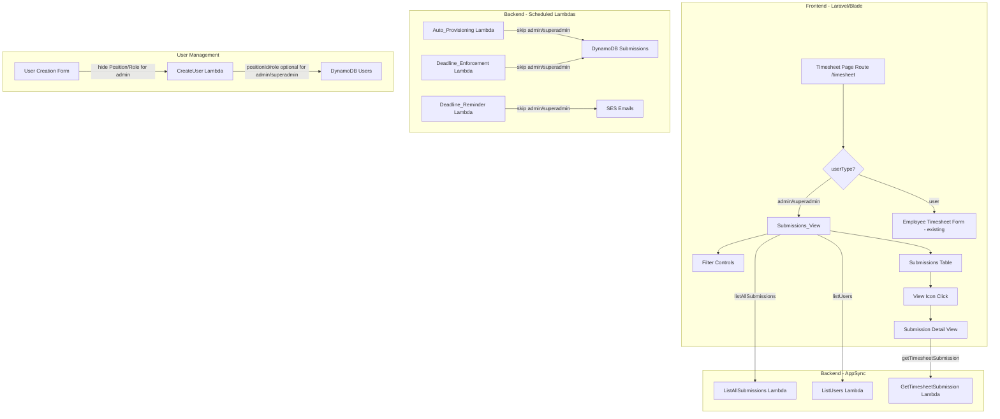

# Design Document: Admin Timesheet View

## Overview

This feature transforms the admin/superadmin Timesheet page from an employee timesheet entry form into a read-only "Timesheet Submissions" overview. It involves changes across three layers:

1. **Backend (Lambda + GraphQL)**: Make `positionId` and `role` optional for admin/superadmin users in the CreateUser resolver. Add `userType` filtering to auto-provisioning, deadline enforcement, and deadline reminder Lambdas so admin/superadmin users are excluded from the timesheet submission workflow.

2. **Frontend (Laravel/Blade)**: Conditionally render the Timesheet page based on `userType`. For admin/superadmin, render a Submissions_View with a filterable table of all employee submissions. For regular users, render the existing employee timesheet entry form unchanged. Hide employee-specific UI elements (+ New Entry, deadline countdown, weekly total target, History button, edit/delete icons) for admin/superadmin.

3. **Frontend (Submission Detail)**: Add a read-only detail view accessible from the Submissions_View that displays an employee's timesheet entries for a given submission.

No new GraphQL queries or mutations are needed. The existing `listAllSubmissions` (with `AdminSubmissionFilterInput`) and `listUsers` queries already support the required data retrieval. The existing `getTimesheetSubmission` query provides the detail view data.

## Architecture



## Components and Interfaces

### 1. CreateUser Lambda (`lambdas/users/CreateUser/handler.py`)

**Current behavior**: Requires `role` and `positionId` for all user types.

**Change**: When `userType` is `admin` or `superadmin`, skip validation of `role` and `positionId`. Store empty string or omit these fields. The `role` field in the GraphQL schema is already required at the type level, so we set a default value of `Employee` for admin/superadmin (or make it optional in the schema). The simpler approach: keep the schema as-is and pass a sentinel value like `"N/A"` or simply skip the enum validation for admin/superadmin users, storing an empty string.

**Recommended approach**: Make `role` and `positionId` optional in `CreateUserInput` by removing the `!` from the GraphQL schema, and in the Lambda, only validate these fields when `userType` is `user`.

**Interface**:
```graphql
input CreateUserInput {
  email: String!
  fullName: String!
  userType: UserType!
  role: Role            # Now optional - not required for admin/superadmin
  positionId: ID        # Now optional - not required for admin/superadmin
  departmentId: ID!
  supervisorId: ID
}
```

### 2. Auto-Provisioning Lambda (`lambdas/auto_provisioning/handler.py`)

**Current behavior**: `_get_all_employees()` scans for all active users regardless of `userType`.

**Change**: Add a filter to exclude `userType` in (`admin`, `superadmin`). Only create Draft submissions for users with `userType == "user"`.

**Modified function signature**:
```python
def _get_all_employees():
    """Get all active users with userType 'user' (excludes admin/superadmin)."""
    table = dynamodb.Table(USERS_TABLE)
    filter_expr = (
        Attr("status").eq("active")
        & Attr("userType").eq("user")
    )
    # ... rest unchanged
```

### 3. Deadline Enforcement Lambda (`lambdas/deadline_enforcement/handler.py`)

**Current behavior**: `_get_all_employees()` filters by `role == "Employee"` and `status == "active"`. `_send_under_40_hours_notifications()` sends to all submitted employees.

**Change**: Add `userType == "user"` filter to `_get_all_employees()`. Add userType check in `_send_under_40_hours_notifications()` to skip admin/superadmin.

### 4. Deadline Reminder Lambda (`lambdas/deadline_reminder/handler.py`)

**Current behavior**: Sends reminders to all users with Draft submissions, only skipping inactive users.

**Change**: Add a `userType` check after fetching the user record. Skip users where `userType` is `admin` or `superadmin`.

### 5. Timesheet Page Controller (Laravel)

**Current behavior**: The `/timesheet` route renders the employee timesheet entry form for all users.

**Change**: In the controller, check `session('user.userType')`. If `admin` or `superadmin`, fetch data via `listAllSubmissions` and `listUsers` GraphQL queries, then render the `submissions-view` Blade template. Otherwise, render the existing `timesheet` template.

**Controller interface**:
```php
public function index(Request $request)
{
    $userType = session('user.userType', 'user');

    if (in_array($userType, ['admin', 'superadmin'])) {
        return $this->renderSubmissionsView($request);
    }

    return $this->renderEmployeeTimesheet($request);
}
```

### 6. Submissions View Blade Template (`frontend/resources/views/pages/timesheet-submissions.blade.php`)

New Blade template rendering:
- Page title: "Timesheet Submissions"
- Filter bar: date range picker (default current week), All Users dropdown, All Status dropdown
- Data table: Week Period, User Name, Total Hours, Status (color-coded badge), Actions (view icon)
- Client-side JavaScript filtering without page reload

### 7. Submission Detail View Blade Template (`frontend/resources/views/pages/submission-detail.blade.php`)

New Blade template rendering:
- Employee name, week period, status, total hours header
- Entries table: Project Code, Sat, Sun, Mon, Tue, Wed, Thu, Fri, Total Hours
- All data read-only (no edit/delete controls)
- Back navigation link to Submissions_View
- Empty state message when no entries exist

### 8. User Management Form (`frontend/resources/views/pages/user-management.blade.php`)

**Change**: Add JavaScript to hide the Position and Role dropdowns when the selected user type in the form is `admin`. Show them when user type is `user`.

## Data Models

### Existing Models (No Changes)

**TimesheetSubmission** (DynamoDB: `Timesheet_Submissions`):
| Field | Type | Description |
|-------|------|-------------|
| submissionId | String (PK) | Unique submission ID |
| periodId | String | Reference to TimesheetPeriod |
| employeeId | String | Reference to User |
| status | String | "Draft" or "Submitted" |
| archived | Boolean | Whether archived |
| totalHours | Number | Sum of all entry hours |
| chargeableHours | Number | Sum of chargeable hours |
| createdAt | String | ISO timestamp |
| updatedAt | String | ISO timestamp |

**TimesheetEntry** (DynamoDB: `Timesheet_Entries`):
| Field | Type | Description |
|-------|------|-------------|
| entryId | String (PK) | Unique entry ID |
| submissionId | String | Reference to TimesheetSubmission |
| projectCode | String | Project charge code |
| saturday - friday | Number | Hours per day |
| totalHours | Number | Sum of daily hours |

**User** (DynamoDB: `Timesheet_Users`):
| Field | Type | Description |
|-------|------|-------------|
| userId | String (PK) | Cognito sub |
| userCode | String | Sequential code (USR-NNN) |
| email | String | User email |
| fullName | String | Display name |
| userType | String | "superadmin", "admin", or "user" |
| role | String | "Project_Manager", "Tech_Lead", "Employee" |
| status | String | "active" or "inactive" |
| positionId | String | Reference to Position (empty for admin/superadmin) |
| departmentId | String | Reference to Department |

### Schema Change

`CreateUserInput.role` changes from `Role!` to `Role` (optional).
`CreateUserInput.positionId` changes from `ID!` to `ID` (optional).

No new tables or indexes are required. The existing `periodId-status-index` GSI on Submissions and `email-index` GSI on Users are sufficient.


## Correctness Properties

*A property is a characteristic or behavior that should hold true across all valid executions of a system — essentially, a formal statement about what the system should do. Properties serve as the bridge between human-readable specifications and machine-verifiable correctness guarantees.*

### Property 1: Admin/superadmin user creation does not require position or role

*For any* user creation request where `userType` is `admin` or `superadmin`, the CreateUser Lambda should successfully create the user without requiring `positionId` or `role` fields. Conversely, *for any* user creation request where `userType` is `user`, omitting `positionId` or `role` should result in a validation error.

**Validates: Requirements 1.1, 1.2**

### Property 2: Auto-provisioning excludes admin/superadmin users

*For any* set of active users in the system, when the Auto_Provisioning_Lambda runs, Draft submissions should only be created for users with `userType == "user"`. No Draft submission should exist for any user with `userType` `admin` or `superadmin`.

**Validates: Requirements 2.1**

### Property 3: Deadline enforcement excludes admin/superadmin users

*For any* set of active users in the system, when the Deadline_Enforcement_Lambda processes an expired period, zero-hour Submitted submissions should only be created for users with `userType == "user"`, and under-40-hours notification emails should only be sent to users with `userType == "user"`.

**Validates: Requirements 2.2, 2.3**

### Property 4: Deadline reminder excludes admin/superadmin users

*For any* set of Draft submissions in the system, when the Deadline_Reminder_Lambda runs, reminder emails should only be sent to users with `userType == "user"`. No reminder email should be sent to any user with `userType` `admin` or `superadmin`.

**Validates: Requirements 2.4**

### Property 5: Timesheet page routing by userType

*For any* authenticated user, when navigating to the Timesheet page, the system should render the Submissions_View if `userType` is `admin` or `superadmin`, and the employee timesheet entry form if `userType` is `user`.

**Validates: Requirements 3.1**

### Property 6: Client-side date range filtering

*For any* set of submissions and any selected date range, the filtered result should contain exactly those submissions whose period falls within the selected date range. No submission outside the range should be displayed, and no submission within the range should be omitted.

**Validates: Requirements 4.4**

### Property 7: Client-side user filtering

*For any* set of submissions and any selected user, the filtered result should contain exactly those submissions where `employeeId` matches the selected user. When "All Users" is selected, all submissions should be displayed.

**Validates: Requirements 4.5**

### Property 8: Client-side status filtering

*For any* set of submissions and any selected status value, the filtered result should contain exactly those submissions whose `status` matches the selected value. When "All Status" is selected, all submissions should be displayed.

**Validates: Requirements 4.6**

### Property 9: Employee-specific UI elements hidden for admin/superadmin

*For any* user with `userType` `admin` or `superadmin`, the Timesheet page should not contain the "+ New Entry" button, the deadline countdown, the weekly total hours target indicator, the "History" button, or any edit/delete action icons.

**Validates: Requirements 5.1, 5.2, 5.3, 5.4, 5.5**

### Property 10: Submission detail view displays complete read-only data

*For any* submission with one or more entries, the detail view should display the employee name, week period, status, total hours, and a table of entries with columns Project Code, Sat–Fri, and Total Hours. No edit or delete controls should be present.

**Validates: Requirements 6.1, 6.2, 6.3**

## Error Handling

| Scenario | Handling |
|----------|----------|
| `listAllSubmissions` GraphQL query fails | Display error alert with retry button on Submissions_View |
| `listUsers` query fails (cannot resolve names) | Display employeeId as fallback in the User Name column |
| `getTimesheetSubmission` fails on detail view | Display error alert with back navigation link |
| User session missing `userType` | Default to `user` type (existing behavior via `session('user.userType', 'user')`) |
| Submission has no entries | Display "No entries were logged for this period" message in detail view |
| Admin/superadmin user created without positionId | Store empty string for positionId in DynamoDB; display "—" in user management table |
| Lambda filter fails to exclude admin/superadmin | Log warning; existing submissions for admin/superadmin are harmless but should be cleaned up |
| Date range picker has invalid range (start > end) | Disable the filter and show all submissions; display inline validation message |

## Testing Strategy

### Unit Tests (pytest for Lambda, PHPUnit/Feature tests for Laravel)

**Lambda unit tests**:
- Test `CreateUser` Lambda accepts admin/superadmin without positionId/role
- Test `CreateUser` Lambda rejects user type `user` without positionId/role
- Test `_get_all_employees()` in auto_provisioning excludes admin/superadmin users
- Test `_get_all_employees()` in deadline_enforcement excludes admin/superadmin users
- Test deadline_reminder skips admin/superadmin users
- Test edge case: all users are admin/superadmin (zero submissions created)
- Test edge case: submission with zero entries renders empty state message

**Frontend tests**:
- Test Timesheet controller routes admin/superadmin to submissions view
- Test Timesheet controller routes regular user to employee timesheet
- Test user creation form hides Position/Role dropdowns for admin userType
- Test submissions view renders correct table columns
- Test detail view renders read-only entries table
- Test detail view shows empty state for submissions with no entries

### Property-Based Tests (Hypothesis for Python Lambdas)

Each property test should run a minimum of 100 iterations. Use the `hypothesis` library for Python Lambda tests.

**Configuration**:
- Library: `hypothesis` (Python)
- Minimum iterations: 100 per property
- Each test tagged with: `Feature: admin-timesheet-view, Property {number}: {property_text}`

**Property test implementations**:

1. **Property 1**: Generate random `CreateUserInput` with `userType` in {admin, superadmin, user}. Verify that validation passes/fails correctly based on presence of positionId/role.
   - Tag: `Feature: admin-timesheet-view, Property 1: Admin/superadmin user creation does not require position or role`

2. **Property 2**: Generate random lists of users with mixed userTypes. Run auto-provisioning logic. Verify Draft submissions exist only for userType "user".
   - Tag: `Feature: admin-timesheet-view, Property 2: Auto-provisioning excludes admin/superadmin users`

3. **Property 3**: Generate random lists of users with mixed userTypes and a period. Run deadline enforcement logic. Verify zero-hour submissions and notification emails only target userType "user".
   - Tag: `Feature: admin-timesheet-view, Property 3: Deadline enforcement excludes admin/superadmin users`

4. **Property 4**: Generate random lists of users with Draft submissions. Run reminder logic. Verify emails only sent to userType "user".
   - Tag: `Feature: admin-timesheet-view, Property 4: Deadline reminder excludes admin/superadmin users`

5. **Property 6**: Generate random submission lists with various periodIds and date ranges. Apply date filter. Verify output contains exactly matching submissions.
   - Tag: `Feature: admin-timesheet-view, Property 6: Client-side date range filtering`

6. **Property 7**: Generate random submission lists with various employeeIds. Apply user filter. Verify output contains exactly matching submissions.
   - Tag: `Feature: admin-timesheet-view, Property 7: Client-side user filtering`

7. **Property 8**: Generate random submission lists with mixed statuses. Apply status filter. Verify output contains exactly matching submissions.
   - Tag: `Feature: admin-timesheet-view, Property 8: Client-side status filtering`

For frontend properties (5, 9, 10), these are best validated through integration/feature tests rather than property-based tests, as they involve Blade template rendering and DOM assertions.
