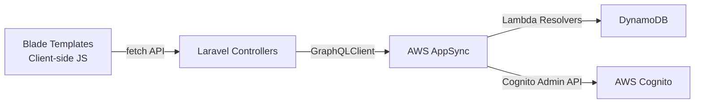

# Design Document: Admin UI Revisions

## Overview

This design covers five targeted revisions to the TimeFlow admin interface:

1. **Confirmation Dialogs** — Replace browser `confirm()` calls on the Approvals page with styled modal Confirmation_Dialogs for approve actions (reject already uses a modal).
2. **Feedback Toasts** — Ensure every CRUD operation across all four master data pages (departments, positions, projects, users) shows a Feedback_Toast on both success and failure, including operations that currently only `window.location.reload()` silently.
3. **Filter Fixes** — Fix broken client-side filters on all four master data pages. The projects page lacks filter JS entirely; the users page doesn't populate department/position dropdowns dynamically.
4. **User Activate/Deactivate Toggle** — Add an Activation_Toggle to the User_Page that calls the existing `activateUser`/`deactivateUser` GraphQL mutations (already deployed in the schema and Lambda resolvers but not exposed in the UI).
5. **Missing Timesheet Investigation** — Investigate and resolve a userId mismatch for a specific user ("Jason Gunawan") between DynamoDB and Cognito, and document the fix.

All changes are frontend-only except for Requirement 4 (which needs new Laravel routes and controller methods to proxy the existing GraphQL mutations) and Requirement 5 (which is a data investigation/fix).

## Architecture

The system follows a three-tier architecture:



Each admin page is a Blade template (`@extends('layouts.app')`) with inline `<script>` blocks pushed via `@push('scripts')`. The JS uses vanilla `fetch()` to call Laravel controller endpoints, which proxy to AppSync via `GraphQLClient`.

### Current State Analysis

| Page | Confirmation Dialog | Feedback Toast | Filters Working | Activate/Deactivate |
|------|-------------------|----------------|-----------------|---------------------|
| Approvals | `confirm()` for approve; modal for reject | ✅ Has toast | N/A | N/A |
| Departments | `confirm()` for delete | ❌ Missing on create/update success | ✅ Working | N/A |
| Positions | `confirm()` for delete | ❌ Missing on create/update success | ✅ Working | N/A |
| Projects | `confirm()` for delete | ✅ Has toast | ❌ No filter JS | N/A |
| Users | `confirm()` for delete | ❌ Missing on create/update success | ⚠️ Partial (no dept/pos dropdown population) | ❌ Not implemented |

### Change Strategy

All five requirements are independent and can be implemented in parallel. The approach is:
- Modify existing Blade templates in-place (no new pages)
- Add a reusable confirmation modal pattern to the approvals page
- Ensure toast is shown before `window.location.reload()` with a short delay
- Add missing filter JavaScript to the projects page; populate dynamic dropdowns on the users page
- Add new controller methods + routes + GraphQL query constants for activate/deactivate
- Create a data migration script for the userId mismatch fix

## Components and Interfaces

### Component 1: Confirmation Dialog (Approvals Page)

**File:** `frontend/resources/views/pages/admin/approvals.blade.php`

Replace the browser `confirm()` in the approve button handler with a styled modal dialog matching the existing rejection modal pattern. The modal will display the entity name and type.

**Interface:**
```javascript
// Opens the confirmation modal for approval
function openApproveModal(entityType, entityId, entityName) { ... }
// Closes the confirmation modal
function closeApproveModal() { ... }
```

The modal HTML will be added alongside the existing `reject-modal-overlay`, using the same CSS patterns (`.modal-overlay`, `.modal`, `.modal-header`, etc.).

### Component 2: Feedback Toast (All Master Data Pages)

**Files:**
- `frontend/resources/views/pages/admin/departments.blade.php`
- `frontend/resources/views/pages/admin/positions.blade.php`
- `frontend/resources/views/pages/admin/projects.blade.php`
- `frontend/resources/views/pages/user-management.blade.php`

Each page already has a `showToast(message, type)` function. The changes are:
- Show success toast before `window.location.reload()` on create/update/delete success
- Add a `setTimeout` delay (e.g., 1500ms) between showing the toast and reloading so the user can read it
- Ensure error toasts are shown for all failure paths

**Pattern (consistent across all pages):**
```javascript
if (result.data.success) {
    closeModal();
    showToast('Department created successfully.', 'success');
    setTimeout(function() { window.location.reload(); }, 1500);
} else {
    closeModal();
    showToast(result.data.error || 'Failed to create department.', 'error');
}
```

### Component 3: Filter Fixes

**Projects Page** (`frontend/resources/views/pages/admin/projects.blade.php`):
- Add `applyFilters()` function matching the pattern from departments/positions pages
- Populate the start date dropdown from table data
- Wire up `change`/`input` event listeners on all three filter controls (search, start date, status)
- Filter by: search text against name/manager columns, start date exact match, status match against `data-approval-status`

**Users Page** (`frontend/resources/views/pages/user-management.blade.php`):
- Populate department filter dropdown from `usersData` (already available as `@json($users)`)
- Populate position filter dropdown from `usersData`
- Add department and position filter logic to the existing `applyFilters()` function
- Add `data-department` and `data-position` attributes to table rows for filtering

### Component 4: User Activate/Deactivate Toggle

**Backend changes:**

1. **GraphQLQueries.php** — Add `DEACTIVATE_USER` and `ACTIVATE_USER` mutation constants
2. **UserManagementController.php** — Add `activate()` and `deactivate()` methods
3. **web.php** — Add routes: `POST /admin/users/{userId}/activate` and `POST /admin/users/{userId}/deactivate`

**Frontend changes (`user-management.blade.php`):**

- Add a toggle switch (`<label class="toggle-switch">`) in each user row's ACTIONS column
- Toggle state reflects `data-user-status` attribute (active = on, inactive = off)
- Disable toggle when `approval_status === 'Pending_Approval'`
- On click: show Confirmation_Dialog → on confirm: call activate/deactivate endpoint → update UI + show toast
- On failure: revert toggle state + show error toast

### Component 5: Missing Timesheet Investigation (Requirement 5)

**Deliverable:** A Python migration script (`scripts/migrate_user_ids.py`) and documentation.

The investigation involves:
1. Query DynamoDB Users table for "Jason Gunawan" to get the stored `userId`
2. Query Cognito user pool to get the actual Cognito `sub` for the same email
3. If mismatched, update the DynamoDB `userId` to match the Cognito `sub`
4. Verify `listMySubmissions` returns data after the fix

This is a one-time data fix, not a code change to the application.

## Data Models

### Existing GraphQL Types (relevant subset)

```graphql
type User {
  userId: ID!
  email: String!
  fullName: String!
  userType: UserType!       # user | admin | superadmin
  status: UserStatus!       # active | inactive
  approval_status: ApprovalStatus!  # Pending_Approval | Approved | Rejected
  departmentId: ID!
  positionId: ID!
  # ... other fields
}

# Existing mutations (already deployed, not yet exposed in UI):
mutation deactivateUser(userId: ID!): User!
mutation activateUser(userId: ID!): User!
```

### New GraphQL Query Constants (to add to GraphQLQueries.php)

```php
public const DEACTIVATE_USER = <<<'GRAPHQL'
mutation DeactivateUser($userId: ID!) {
    deactivateUser(userId: $userId) {
        userId
        fullName
        status
    }
}
GRAPHQL;

public const ACTIVATE_USER = <<<'GRAPHQL'
mutation ActivateUser($userId: ID!) {
    activateUser(userId: $userId) {
        userId
        fullName
        status
    }
}
GRAPHQL;
```

### New Laravel Routes

```php
Route::post('/admin/users/{userId}/activate', [UserManagementController::class, 'activate']);
Route::post('/admin/users/{userId}/deactivate', [UserManagementController::class, 'deactivate']);
```

### UI Data Attributes (added to user table rows)

```html
<tr data-user-id="..." data-user-status="active" data-approval-status="Approved"
    data-department="Engineering" data-position="Developer">
```


## Correctness Properties

*A property is a characteristic or behavior that should hold true across all valid executions of a system — essentially, a formal statement about what the system should do. Properties serve as the bridge between human-readable specifications and machine-verifiable correctness guarantees.*

### Property 1: Approve action shows confirmation dialog

*For any* entity type (department, position, project) on the Approvals page, clicking the approve button shall cause a confirmation modal to become visible in the DOM without triggering any API request.

**Validates: Requirements 1.1, 1.2, 1.3, 1.4**

### Property 2: Cancel dialog preserves entity state

*For any* entity on the Approvals page, if the user opens a confirmation dialog (approve or reject) and then cancels, the entity's approval status and row in the table shall remain unchanged.

**Validates: Requirements 1.6**

### Property 3: Confirmation dialog displays entity identity

*For any* entity on the Approvals page, the confirmation dialog text shall contain both the entity name and the entity type so the user can verify the target.

**Validates: Requirements 1.8**

### Property 4: CRUD operations produce feedback toast

*For any* CRUD operation (create, update, delete) on any master data page (departments, positions, projects, users), the operation shall result in a visible Feedback_Toast element in the DOM — with a success message when the API returns success, or an error message containing the failure reason when the API returns an error.

**Validates: Requirements 2.1, 2.2, 2.3, 2.4, 2.5, 2.6, 2.7, 2.8, 2.9, 2.10, 2.11, 2.12**

### Property 5: Toast styling matches message type

*For any* Feedback_Toast, if the type is "success" then the toast background color shall be green-tinted (`#f0fdf4`) and text color shall be green (`#166534`); if the type is "error" then the background shall be red-tinted (`#fef2f2`) and text color shall be red (`#991b1b`).

**Validates: Requirements 2.14**

### Property 6: Combined filters show only matching rows

*For any* master data page and any combination of active filter values (search text, approval status, department, position, start date, status), the set of visible table rows shall equal exactly the set of rows whose data attributes match ALL active filter criteria simultaneously. A filter with an empty/default value is not active and matches all rows.

**Validates: Requirements 3.3, 3.6, 3.10, 3.15**

### Property 7: Filter dropdowns populated from data

*For any* filter dropdown on a master data page (department dropdown on User_Page, position dropdown on User_Page, start date dropdown on Project_Page), the set of option values in the dropdown shall equal the set of distinct values for that field present in the table data.

**Validates: Requirements 3.16, 3.17, 3.18**

### Property 8: Toggle state reflects user status

*For any* user row on the User_Page where approval_status is not "Pending_Approval", the Activation_Toggle checked state shall be `true` if and only if the user's status is "active".

**Validates: Requirements 4.1, 4.2**

### Property 9: Failed toggle reverts to previous state

*For any* user on the User_Page, if an activate or deactivate API call fails, the Activation_Toggle shall revert to its state before the click, and an error Feedback_Toast shall be visible.

**Validates: Requirements 4.9**

### Property 10: Activate/deactivate round-trip

*For any* active user, calling `deactivateUser` then `activateUser` shall result in the user's status being "active" (original state restored). Conversely, for any inactive user, calling `activateUser` then `deactivateUser` shall result in status "inactive".

**Validates: Requirements 4.10**

### Property 11: Pending users have disabled toggle

*For any* user row on the User_Page where `approval_status` is "Pending_Approval", the Activation_Toggle shall be disabled (not clickable).

**Validates: Requirements 4.12**

## Error Handling

### Frontend Error Handling

| Scenario | Handling |
|----------|----------|
| GraphQL mutation returns error | Show error Feedback_Toast with the error message from the response |
| Network failure (fetch rejects) | Show error Feedback_Toast with "Network error. Please try again." |
| Activate/deactivate fails | Revert toggle to previous state + show error toast |
| Confirmation dialog cancelled | Close dialog, take no action, no API call |
| Empty rejection reason submitted | Focus the textarea, prevent submission |

### Backend Error Handling

| Scenario | Handling |
|----------|----------|
| `activateUser` mutation fails | Laravel controller catches exception, returns `{ success: false, error: message }` with HTTP 422 |
| `deactivateUser` mutation fails | Same as above |
| Invalid userId passed to activate/deactivate | GraphQL resolver returns error, propagated through controller |
| User already in target state (e.g., activating an active user) | The Lambda resolver handles this gracefully (idempotent operation) |

### Data Migration Error Handling (Requirement 5)

- The migration script shall be idempotent — running it multiple times produces the same result
- The script shall log before/after state for audit purposes
- The script shall verify the Cognito user exists before attempting the DynamoDB update
- The script shall use a DynamoDB conditional update to prevent race conditions

## Testing Strategy

### Unit Tests (PHPUnit for Laravel, Browser tests for JS)

Unit tests cover specific examples and edge cases:

- Verify the confirmation modal HTML structure contains required elements (title, confirm button, cancel button)
- Verify toast auto-dismiss timing (5 seconds)
- Verify toast is shown before page reload (setTimeout delay exists)
- Verify the rejection modal opens when reject is clicked (existing behavior)
- Verify the activate/deactivate controller methods return correct JSON structure
- Verify the new routes are registered and accessible
- Verify the GraphQL query constants are syntactically valid

### Property-Based Tests

Property-based tests use a PBT library (for PHP: `phpunit` with data providers generating random inputs; for JavaScript filter logic: `fast-check`) to verify universal properties across generated inputs.

Each property test shall run a minimum of 100 iterations and be tagged with a comment referencing the design property.

**Configuration:**
- PHP: PHPUnit with `@dataProvider` methods generating randomized test data
- JavaScript: `fast-check` library for client-side filter logic testing
- Minimum 100 iterations per property test
- Tag format: `Feature: admin-ui-revisions, Property {number}: {property_text}`

**Property test mapping:**

| Property | Test Approach |
|----------|--------------|
| P1: Approve shows dialog | Generate random entity types, simulate click, assert modal visible |
| P2: Cancel preserves state | Generate random entities, open/cancel dialog, assert no DOM changes |
| P3: Dialog shows entity info | Generate random entity names/types, open dialog, assert text contains both |
| P4: CRUD shows toast | Generate random CRUD operations and success/failure responses, assert toast appears with correct message |
| P5: Toast styling | Generate random type values (success/error), call showToast, assert correct CSS |
| P6: Combined filters | Generate random table data and filter combinations, apply filters, assert visible rows match expected |
| P7: Dropdown population | Generate random data sets, populate dropdowns, assert options match distinct values |
| P8: Toggle reflects status | Generate random user data with various statuses, render rows, assert toggle checked matches status |
| P9: Failed toggle reverts | Generate random users, simulate failed API call, assert toggle reverted |
| P10: Activate/deactivate round-trip | Generate random users, call deactivate then activate (or vice versa), assert original status restored |
| P11: Pending toggle disabled | Generate random users with various approval statuses, assert toggle disabled iff Pending_Approval |
