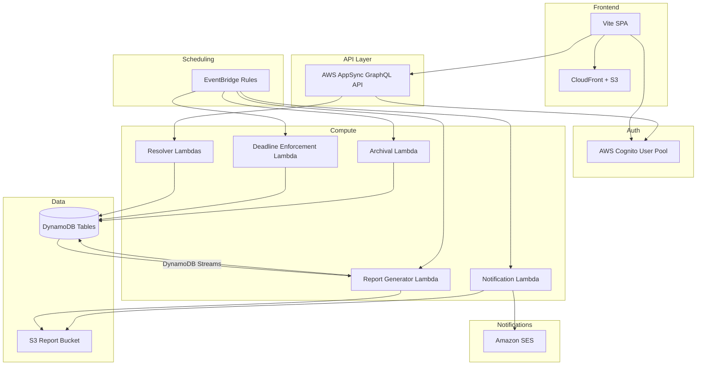
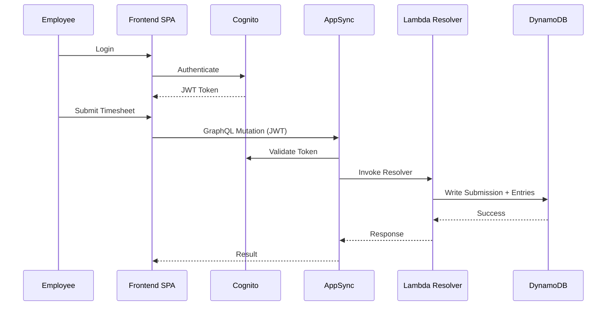
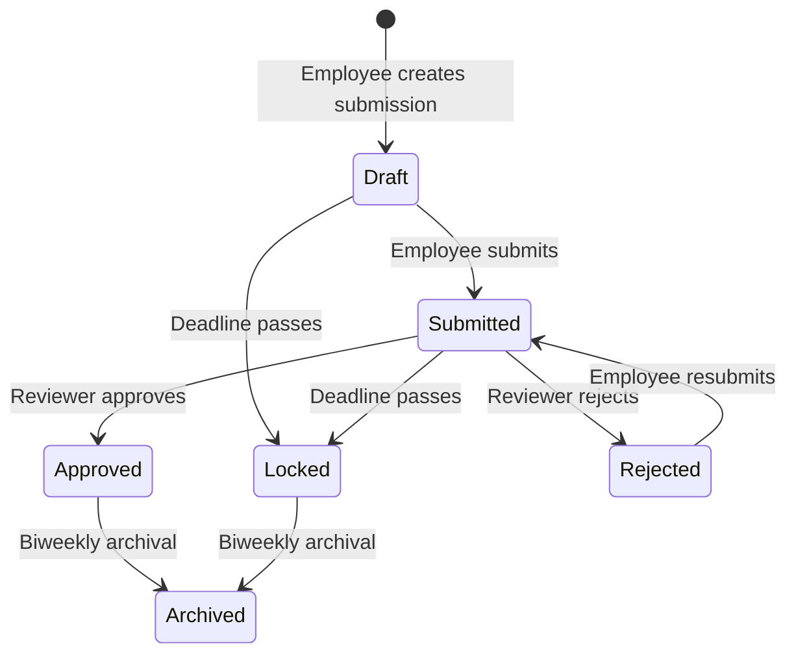
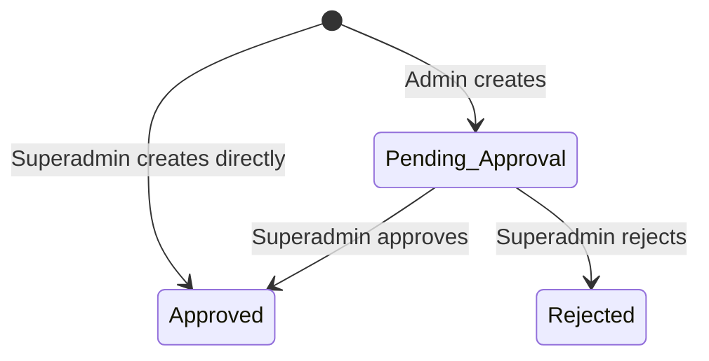

# Design Document: Employee Timesheet Management System

## Overview

The Employee Timesheet Management System is a full-stack web application that replaces the existing Google Sheets and Apps Script-based timesheet workflow. It is built entirely on AWS managed services, leveraging the existing COLABS CDK pipeline infrastructure.

The system enables:
- Employees to submit weekly timesheets (Saturday–Friday) against approved projects
- Project Managers and Tech Leads to review and approve/reject submissions
- Superadmins to manage users, departments, positions, projects, and timesheet periods
- Automated generation of TC Summary and Project Summary reports
- Configurable automated report distribution via email
- Biweekly archival of timesheet data

The application follows a serverless architecture with AWS AppSync (GraphQL) as the API layer, DynamoDB for persistence, Cognito for authentication, Lambda for business logic, EventBridge for scheduling, and SES for email notifications. The frontend is a Vite-based SPA served via CloudFront/S3.

## Architecture

### High-Level Architecture Diagram



### Architecture Decisions

1. **AppSync with Lambda resolvers** over REST API Gateway: GraphQL provides flexible querying for the complex relational data model (users, projects, timesheets, entries). AppSync's built-in Cognito integration simplifies auth.

2. **DynamoDB single-table design per entity** over a single-table design: Given the distinct access patterns (user lookup, period queries, submission-by-employee, entries-by-submission), separate tables with GSIs provide clearer data modeling and simpler resolver logic.

3. **Event-driven report generation** via DynamoDB Streams: When a submission status changes to Approved or Locked, a stream event triggers the Report Generator Lambda. This keeps reports in sync without polling.

4. **EventBridge for scheduling**: Deadline enforcement (locking), report distribution, and archival are scheduled via EventBridge rules, providing cron-like flexibility configurable by Superadmins.

5. **S3 for report storage**: Generated CSV reports are stored in S3 with a structured key prefix (`reports/{type}/{period}/{timestamp}.csv`). This enables both download via pre-signed URLs and attachment to SES emails.

6. **Cognito groups for RBAC**: User types (superadmin, admin, user) map to Cognito groups. AppSync resolver logic checks group membership and role attributes for fine-grained authorization.


### Request Flow



### Submission Status State Machine



### Project Approval State Machine



## Components and Interfaces

### 1. Authentication & Authorization Component

**Service:** AWS Cognito User Pool

- User Pool with custom attributes: `custom:userType` (superadmin/admin/user), `custom:role` (Project_Manager/Tech_Lead/Employee), `custom:departmentId`, `custom:positionId`
- Cognito Groups: `superadmin`, `admin`, `user` — mapped from userType
- AppSync authorization: Cognito User Pool as primary auth mode
- Lambda resolvers perform fine-grained role checks using the `custom:role` claim

**Interfaces:**
- `signUp(email, password, fullName, userType, role, departmentId, positionId)` — admin-initiated, not self-service
- `signIn(email, password) → { accessToken, idToken, refreshToken }`
- `refreshSession(refreshToken) → { accessToken, idToken }`

### 2. User Management Component

**Service:** Lambda Resolver → DynamoDB `Users` table

**Interfaces (GraphQL):**
- `createUser(input: CreateUserInput!): User!` — Superadmin creates admin; Admin creates user
- `updateUser(userId: ID!, input: UpdateUserInput!): User!`
- `deleteUser(userId: ID!): Boolean!`
- `getUser(userId: ID!): User`
- `listUsers(filter: UserFilterInput): UserConnection!`

**Authorization Rules:**
| Caller | Can Create | Can Update | Can Delete |
|---|---|---|---|
| Superadmin | admin, user | admin, user | admin, user |
| Admin | user only | user only | user only |
| User | — | — | — |

### 3. Department & Position Management Component

**Service:** Lambda Resolver → DynamoDB `Departments` and `Positions` tables

**Interfaces (GraphQL):**
- `createDepartment(input: CreateDepartmentInput!): Department!`
- `updateDepartment(departmentId: ID!, input: UpdateDepartmentInput!): Department!`
- `deleteDepartment(departmentId: ID!): Boolean!`
- `listDepartments: [Department!]!`
- `createPosition(input: CreatePositionInput!): Position!`
- `updatePosition(positionId: ID!, input: UpdatePositionInput!): Position!`
- `deletePosition(positionId: ID!): Boolean!`
- `listPositions: [Position!]!`

**Authorization:** Superadmin only for all mutations. All authenticated users can query.

### 4. Project Management Component

**Service:** Lambda Resolver → DynamoDB `Projects` table

**Interfaces (GraphQL):**
- `createProject(input: CreateProjectInput!): Project!`
- `approveProject(projectId: ID!): Project!` — Superadmin only
- `rejectProject(projectId: ID!, reason: String!): Project!` — Superadmin only
- `updateProject(projectId: ID!, input: UpdateProjectInput!): Project!`
- `listProjects(filter: ProjectFilterInput): ProjectConnection!`

**Behavior:**
- Superadmin creates → `approval_status = Approved`
- Admin creates → `approval_status = Pending_Approval`
- Only projects with `approval_status = Approved` are available for timesheet entries

### 5. Timesheet Period Management Component

**Service:** Lambda Resolver → DynamoDB `Timesheet_Periods` table

**Interfaces (GraphQL):**
- `createTimesheetPeriod(input: CreateTimesheetPeriodInput!): TimesheetPeriod!`
- `updateTimesheetPeriod(periodId: ID!, input: UpdateTimesheetPeriodInput!): TimesheetPeriod!`
- `listTimesheetPeriods(filter: PeriodFilterInput): [TimesheetPeriod!]!`
- `getCurrentPeriod: TimesheetPeriod`

**Validation:**
- `startDate` must be a Saturday (day of week = 6)
- `endDate` must be a Friday (day of week = 5)
- `endDate = startDate + 6 days`
- `submissionDeadline >= endDate`
- No overlapping periods

### 6. Timesheet Submission & Entry Component

**Service:** Lambda Resolver → DynamoDB `Timesheet_Submissions` and `Timesheet_Entries` tables

**Interfaces (GraphQL):**
- `createTimesheetSubmission(periodId: ID!): TimesheetSubmission!`
- `submitTimesheet(submissionId: ID!): TimesheetSubmission!`
- `addTimesheetEntry(submissionId: ID!, input: TimesheetEntryInput!): TimesheetEntry!`
- `updateTimesheetEntry(entryId: ID!, input: TimesheetEntryInput!): TimesheetEntry!`
- `removeTimesheetEntry(entryId: ID!): Boolean!`
- `getTimesheetSubmission(submissionId: ID!): TimesheetSubmission!`
- `listMySubmissions(filter: SubmissionFilterInput): [TimesheetSubmission!]!`

**Business Rules:**
- Max 27 entries per submission
- Entries only editable when submission status is Draft or Rejected
- One submission per employee per period
- Charged hours: non-negative float, max 2 decimal places
- Total daily hours across all entries ≤ 24.0
- Row total = sum of 7 daily values (Sat–Fri)
- Employee can only see own submissions

### 7. Timesheet Review Component

**Service:** Lambda Resolver → DynamoDB `Timesheet_Submissions` table

**Interfaces (GraphQL):**
- `approveTimesheet(submissionId: ID!): TimesheetSubmission!`
- `rejectTimesheet(submissionId: ID!): TimesheetSubmission!`
- `listPendingTimesheets: [TimesheetSubmission!]!`

**Authorization:** Project_Manager and Tech_Lead only. Returns submissions for employees under the reviewer's supervision.

**Status Transition Rules:**
- Only `Submitted → Approved` or `Submitted → Rejected` allowed
- Any other transition is rejected with an error

### 8. Deadline Enforcement Component

**Service:** EventBridge Rule → Lambda

**Trigger:** EventBridge cron rule that runs after each period's `submissionDeadline`

**Behavior:**
1. Query all periods where `submissionDeadline` has passed and period is not yet locked
2. For each such period:
   - Update all `Draft` submissions to `Locked`
   - Update all `Submitted` submissions to `Locked`
   - For employees with no submission, create a `Locked` submission with zero hours
3. Log all locking actions

### 9. Report Generator Component

**Service:** Lambda (triggered by DynamoDB Streams and EventBridge)

**Trigger:** DynamoDB Stream on `Timesheet_Submissions` table — fires when `status` changes to `Approved` or `Locked`

**TC Summary Report:**
- Per Tech_Lead, per period
- Columns: Name, Chargeable Hours, Total Hours, Current Period Chargeability, YTD Chargeability
- Includes only employees with Approved or Locked submissions
- Output: CSV stored in S3

**Project Summary Report:**
- Per period
- Columns: Project Charge Code, Project Name, Planned Hours, Charged Hours, Utilization, Current Biweekly Effort
- Includes all projects regardless of status
- Output: CSV stored in S3

**Interfaces:**
- `getTCSummaryReport(techLeadId: ID!, periodId: ID!): ReportDownloadUrl!`
- `getProjectSummaryReport(periodId: ID!): ReportDownloadUrl!`

### 10. Employee Performance Tracking Component

**Service:** Lambda (triggered alongside report generation)

**Trigger:** When a submission transitions to Approved

**Behavior:**
1. Look up or create `Employee_Performance` record for `(userId, year)`
2. Add approved chargeable hours to `ytdChargable_hours`
3. Add approved total hours to `ytdTotalHours`
4. Recalculate `ytdChargabilityPercentage = (ytdChargable_hours / ytdTotalHours) * 100`

### 11. Notification Service Component

**Service:** EventBridge Rule → Lambda → SES

**Trigger:** Configurable EventBridge cron rule (managed by Superadmin)

**Behavior:**
1. Generate Project Summary Report → attach CSV → send to configured recipient list
2. For each Tech_Lead: generate TC Summary Report → attach CSV → send to that Tech_Lead's email
3. On failure: log recipient, report type, error details for retry

**Configuration (stored in DynamoDB):**
- `schedule_cron_expression`: EventBridge cron expression
- `recipient_emails`: list of email addresses for Project Summary
- `enabled`: boolean flag

### 12. Archival Component

**Service:** EventBridge Rule → Lambda

**Trigger:** Runs after report distribution completes for a Biweekly_Period

**Behavior:**
1. Mark all submissions for the ended biweekly period as `archived = true`
2. Retain all entries and metadata
3. Archived submissions returned as read-only via API

### 13. Main Database Management Component

**Service:** Lambda Resolver → DynamoDB

**Interfaces (GraphQL):**
- `listMainDatabase: [MainDatabaseRecord!]!`
- `updateMainDatabaseRecord(id: ID!, input: UpdateMainDBInput!): MainDatabaseRecord!`
- `bulkImportCSV(file: S3ObjectInput!): BulkImportResult!`
- `refreshDatabase(file: S3ObjectInput!): RefreshResult!`

**CSV Schema:** type, value, project_name, budget_effort, project_status

**Behavior:**
- Row-level validation; invalid rows rejected with row number + error detail
- Valid rows persisted; processing continues past failures
- Refresh replaces all existing records


## Data Models

### DynamoDB Table Designs

#### Users Table

| Attribute | Type | Description |
|---|---|---|
| `userId` (PK) | String (UUID) | Unique user identifier |
| `email` | String | Unique email address |
| `fullName` | String | User's full name |
| `userType` | String | `superadmin`, `admin`, or `user` |
| `role` | String | `Project_Manager`, `Tech_Lead`, or `Employee` |
| `positionId` | String | FK to Positions table |
| `departmentId` | String | FK to Departments table |
| `supervisorId` | String | ID of the user's Tech_Lead or PM |
| `createdAt` | String (ISO 8601) | Creation timestamp |
| `createdBy` | String | userId of creator |
| `updatedAt` | String (ISO 8601) | Last update timestamp |
| `updatedBy` | String | userId of last updater |

**GSIs:**
- `email-index`: PK = `email` — for uniqueness checks and login lookup
- `departmentId-index`: PK = `departmentId` — for listing users by department
- `supervisorId-index`: PK = `supervisorId` — for listing team members under a reviewer

#### Departments Table

| Attribute | Type | Description |
|---|---|---|
| `departmentId` (PK) | String (UUID) | Unique department identifier |
| `departmentName` | String | Unique department name |
| `createdAt` | String (ISO 8601) | Creation timestamp |
| `createdBy` | String | userId of creator |
| `updatedAt` | String (ISO 8601) | Last update timestamp |
| `updatedBy` | String | userId of last updater |

**GSIs:**
- `departmentName-index`: PK = `departmentName` — for uniqueness enforcement

#### Positions Table

| Attribute | Type | Description |
|---|---|---|
| `positionId` (PK) | String (UUID) | Unique position identifier |
| `positionName` | String | Unique position name |
| `description` | String | Position description |
| `createdAt` | String (ISO 8601) | Creation timestamp |
| `createdBy` | String | userId of creator |
| `updatedAt` | String (ISO 8601) | Last update timestamp |
| `updatedBy` | String | userId of last updater |

**GSIs:**
- `positionName-index`: PK = `positionName` — for uniqueness enforcement

#### Projects Table

| Attribute | Type | Description |
|---|---|---|
| `projectId` (PK) | String (UUID) | Unique project identifier |
| `projectCode` | String | Unique charge code |
| `projectName` | String | Project display name |
| `startDate` | String (ISO 8601) | Project start date |
| `plannedHours` | Number (float) | Budgeted hours |
| `projectManagerId` | String | FK to Users table |
| `status` | String | `Active`, `Inactive`, `Completed` |
| `approval_status` | String | `Pending_Approval`, `Approved`, `Rejected` |
| `rejectionReason` | String | Reason for rejection (if rejected) |
| `createdAt` | String (ISO 8601) | Creation timestamp |
| `createdBy` | String | userId of creator |
| `updatedAt` | String (ISO 8601) | Last update timestamp |
| `updatedBy` | String | userId of last updater |

**GSIs:**
- `projectCode-index`: PK = `projectCode` — for uniqueness enforcement and lookup
- `approval_status-index`: PK = `approval_status` — for filtering by approval status
- `projectManagerId-index`: PK = `projectManagerId` — for listing projects by manager

#### Timesheet_Periods Table

| Attribute | Type | Description |
|---|---|---|
| `periodId` (PK) | String (UUID) | Unique period identifier |
| `startDate` | String (ISO 8601) | Period start (Saturday) |
| `endDate` | String (ISO 8601) | Period end (Friday) |
| `submissionDeadline` | String (ISO 8601) | Deadline for submissions |
| `periodString` | String | Human-readable label (e.g., "2025-01-04 to 2025-01-10") |
| `biweeklyPeriodId` | String | Groups two weeks into a biweekly cycle |
| `isLocked` | Boolean | Whether deadline enforcement has run |
| `createdAt` | String (ISO 8601) | Creation timestamp |
| `createdBy` | String | userId of creator |

**GSIs:**
- `startDate-index`: PK = `startDate` — for overlap detection and period lookup

#### Timesheet_Submissions Table

| Attribute | Type | Description |
|---|---|---|
| `submissionId` (PK) | String (UUID) | Unique submission identifier |
| `periodId` | String | FK to Timesheet_Periods |
| `employeeId` | String | FK to Users table |
| `status` | String | `Draft`, `Submitted`, `Approved`, `Rejected`, `Locked` |
| `archived` | Boolean | Whether submission is archived |
| `approvedBy` | String | userId of approver |
| `approvedAt` | String (ISO 8601) | Approval timestamp |
| `totalHours` | Number (float) | Sum of all entry totals |
| `chargeableHours` | Number (float) | Sum of chargeable entry totals |
| `createdAt` | String (ISO 8601) | Creation timestamp |
| `updatedAt` | String (ISO 8601) | Last update timestamp |
| `updatedBy` | String | userId of last updater |

**GSIs:**
- `employeeId-periodId-index`: PK = `employeeId`, SK = `periodId` — for one-submission-per-period enforcement and employee lookup
- `periodId-status-index`: PK = `periodId`, SK = `status` — for deadline enforcement and reviewer queries
- `status-index`: PK = `status` — for listing submissions by status

**DynamoDB Streams:** Enabled (NEW_AND_OLD_IMAGES) — triggers Report Generator on status changes

#### Timesheet_Entries Table

| Attribute | Type | Description |
|---|---|---|
| `entryId` (PK) | String (UUID) | Unique entry identifier |
| `submissionId` | String | FK to Timesheet_Submissions |
| `projectCode` | String | FK to Projects table |
| `saturday` | Number (float) | Hours for Saturday |
| `sunday` | Number (float) | Hours for Sunday |
| `monday` | Number (float) | Hours for Monday |
| `tuesday` | Number (float) | Hours for Tuesday |
| `wednesday` | Number (float) | Hours for Wednesday |
| `thursday` | Number (float) | Hours for Thursday |
| `friday` | Number (float) | Hours for Friday |
| `totalHours` | Number (float) | Sum of daily hours |
| `createdAt` | String (ISO 8601) | Creation timestamp |
| `updatedAt` | String (ISO 8601) | Last update timestamp |

**GSIs:**
- `submissionId-index`: PK = `submissionId` — for fetching all entries for a submission
- `projectCode-index`: PK = `projectCode` — for project-level hour aggregation

#### Employee_Performance Table

| Attribute | Type | Description |
|---|---|---|
| `userId` (PK) | String | FK to Users table |
| `year` (SK) | Number | Calendar year |
| `ytdChargable_hours` | Number (float) | Year-to-date chargeable hours |
| `ytdTotalHours` | Number (float) | Year-to-date total hours |
| `ytdChargabilityPercentage` | Number (float) | `(ytdChargable_hours / ytdTotalHours) * 100` |
| `updatedAt` | String (ISO 8601) | Last update timestamp |

**Key:** Composite primary key `(userId, year)` — one record per employee per year

#### Report_Distribution_Config Table

| Attribute | Type | Description |
|---|---|---|
| `configId` (PK) | String | Singleton config identifier (e.g., `"default"`) |
| `schedule_cron_expression` | String | EventBridge cron expression |
| `recipient_emails` | List[String] | Email addresses for Project Summary |
| `enabled` | Boolean | Whether distribution is active |
| `updatedAt` | String (ISO 8601) | Last update timestamp |
| `updatedBy` | String | userId of last updater |

#### Main_Database Table

| Attribute | Type | Description |
|---|---|---|
| `recordId` (PK) | String (UUID) | Unique record identifier |
| `type` | String | Record type |
| `chargeCode` | String | Project charge code |
| `projectName` | String | Project name |
| `budgetEffort` | Number (float) | Budget effort hours |
| `projectStatus` | String | Project status |
| `createdAt` | String (ISO 8601) | Creation timestamp |
| `updatedAt` | String (ISO 8601) | Last update timestamp |
| `updatedBy` | String | userId of last updater |

### GraphQL Schema Types (Key Types)

```graphql
type User {
  userId: ID!
  email: String!
  fullName: String!
  userType: UserType!
  role: Role!
  positionId: ID!
  departmentId: ID!
  supervisorId: ID
  createdAt: AWSDateTime!
  updatedAt: AWSDateTime
}

enum UserType { superadmin admin user }
enum Role { Project_Manager Tech_Lead Employee }
enum SubmissionStatus { Draft Submitted Approved Rejected Locked }
enum ApprovalStatus { Pending_Approval Approved Rejected }

type TimesheetSubmission {
  submissionId: ID!
  periodId: ID!
  employeeId: ID!
  status: SubmissionStatus!
  archived: Boolean!
  entries: [TimesheetEntry!]!
  totalHours: Float!
  chargeableHours: Float!
  approvedBy: ID
  approvedAt: AWSDateTime
  createdAt: AWSDateTime!
  updatedAt: AWSDateTime
}

type TimesheetEntry {
  entryId: ID!
  submissionId: ID!
  projectCode: String!
  saturday: Float!
  sunday: Float!
  monday: Float!
  tuesday: Float!
  wednesday: Float!
  thursday: Float!
  friday: Float!
  totalHours: Float!
}

type TimesheetPeriod {
  periodId: ID!
  startDate: AWSDate!
  endDate: AWSDate!
  submissionDeadline: AWSDateTime!
  periodString: String!
  biweeklyPeriodId: String
  isLocked: Boolean!
}

type Project {
  projectId: ID!
  projectCode: String!
  projectName: String!
  startDate: AWSDate!
  plannedHours: Float!
  projectManagerId: ID!
  status: String!
  approval_status: ApprovalStatus!
  rejectionReason: String
}

type EmployeePerformance {
  userId: ID!
  year: Int!
  ytdChargable_hours: Float!
  ytdTotalHours: Float!
  ytdChargabilityPercentage: Float!
}
```

