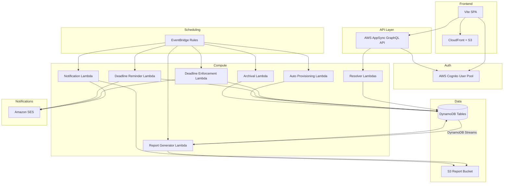
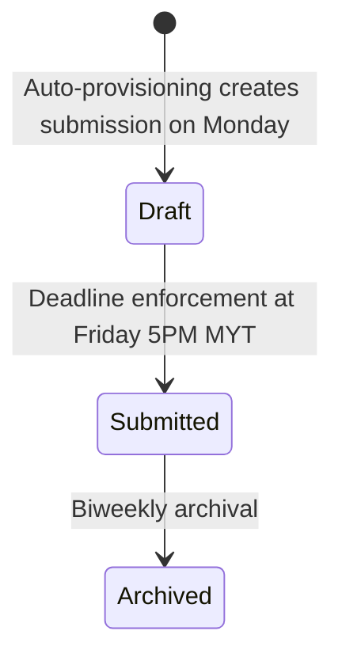
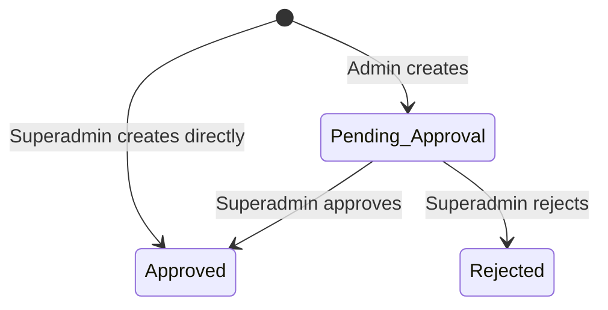

# Design Document: Employee Timesheet Management System

## Overview

The Employee Timesheet Management System is a full-stack web application that replaces the existing Google Sheets and Apps Script-based timesheet workflow. It is built entirely on AWS managed services, leveraging the existing COLABS CDK pipeline infrastructure.

The system enables:
- Employees to fill weekly timesheets (Monday–Friday) against approved projects
- Automatic submission at Friday 5PM MYT deadline (no manual submit)
- Superadmins to manage users, departments, positions, projects, and timesheet periods
- Automated generation of TC Summary and Project Summary reports on submission
- Configurable automated report distribution via email
- Biweekly archival of timesheet data
- Auto-provisioning of weekly periods and Draft submissions every Monday

The application follows a serverless architecture with AWS AppSync (GraphQL) as the API layer, DynamoDB for persistence, Cognito for authentication, Lambda for business logic, EventBridge for scheduling, and SES for email notifications. The frontend is a Vite-based SPA served via CloudFront/S3.

## Architecture

### High-Level Architecture Diagram



### Architecture Decisions

1. **AppSync with Lambda resolvers** over REST API Gateway: GraphQL provides flexible querying for the complex relational data model (users, projects, timesheets, entries). AppSync's built-in Cognito integration simplifies auth.

2. **DynamoDB single-table design per entity** over a single-table design: Given the distinct access patterns (user lookup, period queries, submission-by-employee, entries-by-submission), separate tables with GSIs provide clearer data modeling and simpler resolver logic.

3. **Event-driven report generation** via DynamoDB Streams: When a submission status changes to Submitted, a stream event triggers the Report Generator Lambda. This keeps reports in sync without polling.

4. **EventBridge for scheduling**: Deadline enforcement, deadline reminders, auto-provisioning, report distribution, and archival are scheduled via EventBridge rules.

5. **S3 for report storage**: Generated CSV reports are stored in S3 with a structured key prefix (`reports/{type}/{period}/{timestamp}.csv`). This enables both download via pre-signed URLs and attachment to SES emails.

6. **Cognito groups for RBAC**: User types (superadmin, admin, user) map to Cognito groups. AppSync resolver logic checks group membership and role attributes for fine-grained authorization.

7. **No manual submit / No approval flow**: Timesheets are auto-submitted at the Friday 5PM MYT deadline. There is no manual submit button and no approval/rejection workflow. Only two statuses exist: Draft and Submitted.

### Submission Status State Machine



### Project Approval State Machine



## Components and Interfaces


### 1. Authentication & Authorization Component

**Service:** AWS Cognito User Pool

- User Pool with custom attributes: `custom:userType` (superadmin/admin/user), `custom:role` (Project_Manager/Tech_Lead/Employee), `custom:departmentId`, `custom:positionId`
- Cognito Groups: `superadmin`, `admin`, `user` — mapped from userType
- AppSync authorization: Cognito User Pool as primary auth mode
- Lambda resolvers perform fine-grained role checks using the `custom:role` claim

### 2. User Management Component

**Service:** Lambda Resolver → DynamoDB `Users` table

**Interfaces (GraphQL):**
- `createUser(input: CreateUserInput!): User!`
- `updateUser(userId: ID!, input: UpdateUserInput!): User!`
- `deleteUser(userId: ID!): Boolean!`
- `deactivateUser(userId: ID!): User!`
- `activateUser(userId: ID!): User!`
- `getUser(userId: ID!): User`
- `listUsers(filter: UserFilterInput): UserConnection!`

**User Status (Soft Delete):**
- Users have a `status` field: `active` (default) or `inactive`
- `deactivateUser` sets status to inactive and disables the Cognito account via `admin_disable_user`
- `activateUser` sets status to active and re-enables the Cognito account via `admin_enable_user`
- Deactivated users' data remains visible for historical queries and reports
- Inactive users are excluded from auto-provisioning, deadline enforcement, and deadline reminders
- `listUsers` supports filtering by `status`

### 3. Department & Position Management Component

**Service:** Lambda Resolver → DynamoDB `Departments` and `Positions` tables

**Interfaces (GraphQL):**
- `createDepartment / updateDepartment / deleteDepartment / listDepartments`
- `createPosition / updatePosition / deletePosition / listPositions`

**Authorization:** Superadmin only for all mutations. All authenticated users can query.

### 4. Project Management Component

**Service:** Lambda Resolver → DynamoDB `Projects` table

**Behavior:**
- Superadmin creates → `approval_status = Approved`
- Admin creates → `approval_status = Pending_Approval`
- Only projects with `approval_status = Approved` are available for timesheet entries

### 5. Timesheet Period Management Component

**Service:** Lambda Resolver → DynamoDB `Timesheet_Periods` table

**Interfaces (GraphQL):**
- `createTimesheetPeriod(input: CreateTimesheetPeriodInput!): TimesheetPeriod!`
- `updateTimesheetPeriod(periodId: ID!, input: UpdateTimesheetPeriodInput!): TimesheetPeriod!`
- `listTimesheetPeriods(filter: PeriodFilterInput): [TimesheetPeriod!]!`
- `getCurrentPeriod: TimesheetPeriod`

**Validation:**
- `startDate` must be a Monday (day of week = 0)
- `endDate` must be a Friday (day of week = 4)
- `endDate = startDate + 4 days`
- `submissionDeadline` auto-computed as endDate at 5PM MYT (09:00 UTC)
- No overlapping periods

### 6. Timesheet Submission & Entry Component

**Service:** Lambda Resolver → DynamoDB `Timesheet_Submissions` and `Timesheet_Entries` tables

**Interfaces (GraphQL):**
- `addTimesheetEntry(submissionId: ID!, input: TimesheetEntryInput!): TimesheetEntry!`
- `updateTimesheetEntry(entryId: ID!, input: TimesheetEntryInput!): TimesheetEntry!`
- `removeTimesheetEntry(entryId: ID!): Boolean!`
- `getTimesheetSubmission(submissionId: ID!): TimesheetSubmission!`
- `listMySubmissions(filter: SubmissionFilterInput): [TimesheetSubmission!]!`

**Business Rules:**
- Max 27 entries per submission
- Entries only editable when submission status is Draft
- One submission per employee per period (auto-created by provisioning)
- Charged hours: non-negative float, max 2 decimal places
- Total daily hours across all entries ≤ 24.0
- Row total = sum of 7 daily values (Sat–Fri)
- Employee can only see own submissions
- No manual submit — auto-submit only at deadline

### 7. Auto-Provisioning Component

**Service:** EventBridge Rule → Lambda

**Trigger:** Every Monday 00:05 MYT (Sunday 16:05 UTC)

**Behavior:**
1. Compute the current week's Monday–Friday period
2. Create the period record if it doesn't exist
3. Create a Draft submission for every active Employee (inactive users are skipped)

### 8. Deadline Reminder Component

**Service:** EventBridge Rule → Lambda → SES

**Trigger:** Every Friday 1PM MYT (05:00 UTC) — 4 hours before deadline

**Behavior:**
1. Find the current active period
2. Query all Draft submissions for that period
3. Send reminder email to each employee with a Draft submission

### 9. Deadline Enforcement Component

**Service:** EventBridge Rule → Lambda

**Trigger:** Every Friday 5:05PM MYT (09:05 UTC) — 5 minutes after deadline

**Behavior:**
1. Query all periods where `submissionDeadline` has passed and `isLocked` is false
2. For each such period:
   - Auto-submit all `Draft` submissions (Draft → Submitted)
   - Create `Submitted` submissions with zero hours for active employees without one (inactive users are skipped)
   - Send under-40-hours email notification to employees
   - Mark period as `isLocked = true`

### 10. Report Generator Component

**Service:** Lambda (triggered by DynamoDB Streams)

**Trigger:** DynamoDB Stream on `Timesheet_Submissions` table — fires when `status` changes to `Submitted`

**TC Summary Report:** Per Tech_Lead, per period. Includes only Submitted submissions.
**Project Summary Report:** Per period. Includes all projects regardless of status.

### 11. Employee Performance Tracking Component

**Service:** Lambda (triggered alongside report generation)

**Trigger:** When a submission transitions to Submitted

### 12. Notification Service Component

**Service:** EventBridge Rule → Lambda → SES

**Trigger:** Configurable EventBridge cron rule (managed by Superadmin)

### 13. Archival Component

**Service:** EventBridge Rule → Lambda

**Trigger:** Runs after report distribution completes for a Biweekly_Period

## Data Models

### Key DynamoDB Tables

- **Timesheet_Periods**: periodId (PK), startDate (Monday), endDate (Friday), submissionDeadline (auto-computed Friday 5PM MYT), periodString, isLocked
- **Timesheet_Submissions**: submissionId (PK), periodId, employeeId, status (Draft|Submitted), archived, totalHours, chargeableHours
- **Timesheet_Entries**: entryId (PK), submissionId, projectCode, saturday–friday daily hours, totalHours
- **Employee_Performance**: userId (PK), year (SK), ytdChargable_hours, ytdTotalHours, ytdChargabilityPercentage

### GraphQL Schema Key Types

```graphql
enum SubmissionStatus { Draft Submitted }
enum ApprovalStatus { Pending_Approval Approved Rejected }
```

Note: The full GraphQL schema is in `graphql/schema.graphql`.
