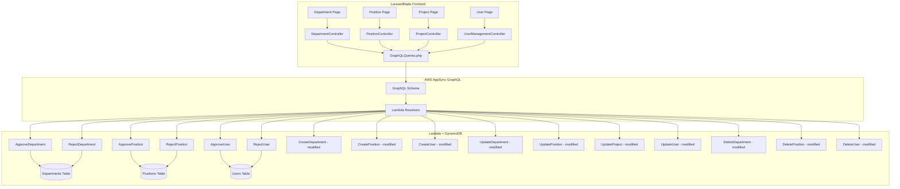
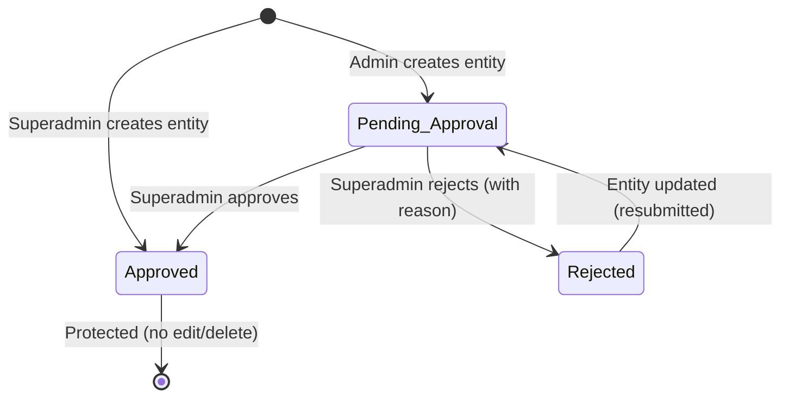

# Design Document: Master Data Approval Workflow

## Overview

This design extends the TimeFlow platform with a unified approval workflow for all Master Data entities: Departments, Positions, Projects, and Users. Currently, Projects already have `approval_status` and `rejectionReason` fields with approve/reject Lambda resolvers. Departments and Positions have no approval fields, and Users have a `status` field (active/inactive) but no separate `approval_status`.

The feature introduces:
1. `approval_status` and `rejectionReason` fields on Department, Position, and User types
2. Admin users can create Departments and Positions (currently superadmin-only)
3. Admin-created entities start as `Pending_Approval`; superadmin-created entities are auto-`Approved`
4. Superadmin-only approve/reject mutations for Departments, Positions, and Users
5. Approved entities are protected from update and delete
6. UI badges, conditional action icons, and approval status filtering on all Master Data pages

The existing Project approval flow (ApproveProject, RejectProject) serves as the reference implementation. The new mutations and Lambda resolvers for Departments, Positions, and Users will follow the same patterns.

## Architecture

The system follows the existing three-tier architecture:



### Key Design Decisions

1. **Follow existing Project approval pattern**: The ApproveProject/RejectProject Lambda handlers are the proven template. New approve/reject handlers for Department, Position, and User will mirror this structure exactly.

2. **Shared auth utility**: All authorization checks use `shared/auth.py`'s `require_user_type()` — no new auth mechanism needed.

3. **Approval status separate from User.status**: The User type already has a `status` field (active/inactive) for account state. `approval_status` is a distinct field tracking the approval lifecycle, as specified in Requirement 8.8.

4. **Client-side filtering**: Approval status filtering on the frontend will be done client-side using JavaScript, consistent with the existing filter patterns on the projects page. The `listDepartments` and `listPositions` queries return all records (no pagination), making client-side filtering practical.

5. **Protection enforcement at Lambda level**: Update and delete protection for approved entities is enforced in each Lambda handler, not via AppSync authorization directives. This keeps the pattern consistent with the existing UpdateProject handler.

## Components and Interfaces

### 1. GraphQL Schema Changes

**New fields on existing types:**
- `Department`: add `approval_status: ApprovalStatus!` and `rejectionReason: String`
- `Position`: add `approval_status: ApprovalStatus!` and `rejectionReason: String`
- `User`: add `approval_status: ApprovalStatus!` and `rejectionReason: String`

**New mutations:**
- `approveDepartment(departmentId: ID!): Department!`
- `rejectDepartment(departmentId: ID!, reason: String!): Department!`
- `approvePosition(positionId: ID!): Position!`
- `rejectPosition(positionId: ID!, reason: String!): Position!`
- `approveUser(userId: ID!): User!`
- `rejectUser(userId: ID!, reason: String!): User!`

### 2. New Lambda Resolvers

Six new Lambda handlers following the per-operation directory structure:

| Handler | Path | Table Access |
|---------|------|-------------|
| ApproveDepartment | `lambdas/departments/ApproveDepartment/handler.py` | Departments (RW) |
| RejectDepartment | `lambdas/departments/RejectDepartment/handler.py` | Departments (RW) |
| ApprovePosition | `lambdas/positions/ApprovePosition/handler.py` | Positions (RW) |
| RejectPosition | `lambdas/positions/RejectPosition/handler.py` | Positions (RW) |
| ApproveUser | `lambdas/users/ApproveUser/handler.py` | Users (RW) |
| RejectUser | `lambdas/users/RejectUser/handler.py` | Users (RW) |

Each handler:
- Calls `require_user_type(event, ["superadmin"])` for authorization
- Validates entity exists and is in `Pending_Approval` status
- Updates `approval_status`, `updatedAt`, `updatedBy` (and `rejectionReason` for reject)
- Returns the full updated item

### 3. Modified Lambda Resolvers

**CreateDepartment** and **CreatePosition**: Change `require_user_type` from `["superadmin"]` to `["superadmin", "admin"]`. Add approval_status logic: superadmin → `Approved`, admin → `Pending_Approval`. Add `approval_status` and `rejectionReason` fields to the created item.

**CreateUser**: Already allows admin creation. Add `approval_status` assignment based on caller's userType.

**UpdateDepartment, UpdatePosition, UpdateProject, UpdateUser**: Add approval status check at the start — reject updates if `approval_status == "Approved"`. Allow updates for `Pending_Approval` and `Rejected` entities.

**DeleteDepartment, DeletePosition, DeleteUser**: Add approval status check — reject deletes if `approval_status == "Approved"`.

### 4. CDK Stack Changes

Add six new Lambda functions and AppSync resolvers in `lambda_stack.py`:
- `_create_department_lambdas()`: Add ApproveDepartment and RejectDepartment
- `_create_position_lambdas()`: Add ApprovePosition and RejectPosition
- `_create_user_lambdas()`: Add ApproveUser and RejectUser

### 5. Frontend Changes

**GraphQLQueries.php**: Add six new mutation constants and update LIST_DEPARTMENTS, LIST_POSITIONS, LIST_USERS_FULL to include `approval_status` and `rejectionReason` fields.

**Controllers**: Add `approve` and `reject` methods to DepartmentController, PositionController, and UserManagementController.

**Blade Templates**: Update departments.blade.php, positions.blade.php, projects.blade.php, and user-management.blade.php:
- Dynamic approval status badges (green/yellow/red)
- Conditional edit/delete icons based on approval_status
- Approve/reject buttons for superadmin on pending entities
- Rejection reason modal
- Approval status filter dropdown

**Routes (web.php)**: Add POST routes for approve/reject actions on departments, positions, and users.


## Data Models

### DynamoDB Table Changes

**Departments Table** — new attributes:
| Attribute | Type | Description |
|-----------|------|-------------|
| `approval_status` | String | One of: `Pending_Approval`, `Approved`, `Rejected` |
| `rejectionReason` | String | Reason provided by superadmin on rejection (empty string if not rejected) |

**Positions Table** — new attributes:
| Attribute | Type | Description |
|-----------|------|-------------|
| `approval_status` | String | One of: `Pending_Approval`, `Approved`, `Rejected` |
| `rejectionReason` | String | Reason provided by superadmin on rejection (empty string if not rejected) |

**Users Table** — new attributes:
| Attribute | Type | Description |
|-----------|------|-------------|
| `approval_status` | String | One of: `Pending_Approval`, `Approved`, `Rejected` |
| `rejectionReason` | String | Reason provided by superadmin on rejection (empty string if not rejected) |

**Projects Table** — no changes (already has `approval_status` and `rejectionReason`).

### Data Migration

Existing Department and Position records in DynamoDB do not have `approval_status`. Two approaches:

**Chosen approach: Default at read time + backfill script**
- Lambda list handlers treat missing `approval_status` as `Approved` (existing records were created by superadmins)
- A one-time migration script sets `approval_status = "Approved"` and `rejectionReason = ""` on all existing Department, Position, and User records
- This ensures consistency without blocking deployment

### GraphQL Type Updates

```graphql
type Department @aws_api_key @aws_cognito_user_pools {
  departmentId: ID!
  departmentName: String!
  approval_status: ApprovalStatus!
  rejectionReason: String
  createdAt: AWSDateTime!
  createdBy: ID
  updatedAt: AWSDateTime
  updatedBy: ID
}

type Position @aws_api_key @aws_cognito_user_pools {
  positionId: ID!
  positionName: String!
  description: String
  approval_status: ApprovalStatus!
  rejectionReason: String
  createdAt: AWSDateTime!
  createdBy: ID
  updatedAt: AWSDateTime
  updatedBy: ID
}

type User @aws_api_key @aws_cognito_user_pools {
  userId: ID!
  userCode: String
  email: String!
  fullName: String!
  userType: UserType!
  role: Role!
  status: UserStatus!
  approval_status: ApprovalStatus!
  rejectionReason: String
  positionId: ID!
  departmentId: ID!
  supervisorId: ID
  createdAt: AWSDateTime!
  createdBy: ID
  updatedAt: AWSDateTime
  updatedBy: ID
}
```

### Approval State Machine



Valid transitions:
- `Pending_Approval` → `Approved` (via approve mutation)
- `Pending_Approval` → `Rejected` (via reject mutation with reason)
- `Rejected` → `Pending_Approval` (when entity is updated, it resets to pending)
- `Approved` entities cannot be updated or deleted


## Correctness Properties

*A property is a characteristic or behavior that should hold true across all valid executions of a system — essentially, a formal statement about what the system should do. Properties serve as the bridge between human-readable specifications and machine-verifiable correctness guarantees.*

### Property 1: Creation approval status is determined by creator's userType

*For any* entity type (Department, Position, Project, User) and *for any* valid creation input, if the creator has userType `admin` then the resulting entity's `approval_status` SHALL be `Pending_Approval`, and if the creator has userType `superadmin` then the resulting entity's `approval_status` SHALL be `Approved`.

**Validates: Requirements 2.1, 2.2, 2.3, 2.4, 2.5, 2.6, 2.7, 2.8, 3.1, 3.2**

### Property 2: Regular users cannot create Departments or Positions

*For any* user with userType `user` and *for any* valid Department or Position creation input, the create mutation SHALL raise an authorization error and no entity SHALL be persisted.

**Validates: Requirements 3.5**

### Property 3: Approving a pending entity transitions it to Approved

*For any* entity (Department, Position, or User) with `approval_status` equal to `Pending_Approval`, when a superadmin calls the corresponding approve mutation, the entity's `approval_status` SHALL become `Approved`.

**Validates: Requirements 4.1, 4.2, 4.3**

### Property 4: Rejecting a pending entity transitions it to Rejected and stores the reason

*For any* entity (Department, Position, or User) with `approval_status` equal to `Pending_Approval` and *for any* non-empty rejection reason string, when a superadmin calls the corresponding reject mutation, the entity's `approval_status` SHALL become `Rejected` and its `rejectionReason` SHALL equal the provided reason string.

**Validates: Requirements 4.4, 4.5, 4.6**

### Property 5: Admin users cannot approve or reject entities

*For any* entity type and *for any* user with userType `admin`, calling an approve or reject mutation SHALL raise an authorization error and the entity's `approval_status` SHALL remain unchanged.

**Validates: Requirements 4.7**

### Property 6: Non-pending entities cannot be approved or rejected

*For any* entity with `approval_status` equal to `Approved` or `Rejected`, calling the corresponding approve or reject mutation (even by a superadmin) SHALL raise an error and the entity SHALL remain unchanged.

**Validates: Requirements 4.8**

### Property 7: Approval and rejection actions record audit fields

*For any* successful approve or reject action, the resulting entity's `updatedBy` field SHALL equal the superadmin's userId and the `updatedAt` field SHALL be a valid ISO timestamp not earlier than the time the request was initiated.

**Validates: Requirements 4.9**

### Property 8: Approved entities are protected from update and delete

*For any* entity (Department, Position, Project, or User) with `approval_status` equal to `Approved`, *for any* update input and *for any* caller (admin or superadmin), the update mutation SHALL raise an error. Similarly, *for any* delete request, the delete mutation SHALL raise an error. The entity SHALL remain unchanged in both cases.

**Validates: Requirements 5.1, 5.2, 5.3, 5.4, 5.5**

### Property 9: Non-approved entities allow update and delete

*For any* entity with `approval_status` equal to `Pending_Approval` or `Rejected`, and *for any* caller with userType `admin` or `superadmin`, update and delete mutations SHALL succeed without raising an approval-related error.

**Validates: Requirements 5.6**

### Property 10: Approval status filter returns only matching entities

*For any* list of entities with mixed approval statuses and *for any* selected filter value (`Pending_Approval`, `Approved`, or `Rejected`), the filtered result SHALL contain only entities whose `approval_status` matches the selected value. When the filter is `All`, the result SHALL contain all entities.

**Validates: Requirements 7.4, 7.5**

## Error Handling

### Lambda Resolver Errors

| Error Condition | Error Type | Message Pattern |
|----------------|------------|-----------------|
| Caller lacks required userType | `ForbiddenError` (raised as Exception) | "User type '{type}' is not authorized. Allowed types: [...]" |
| Entity not found | `ValueError` | "{EntityType} '{id}' not found" |
| Entity not in Pending_Approval | `ValueError` | "Cannot approve/reject {entity} with approval_status '{status}'. Only Pending_Approval entities can be approved/rejected" |
| Rejection reason empty/blank | `ValueError` | "Rejection reason is required" |
| Update on Approved entity | `ValueError` | "Cannot update {entity}: approved entities cannot be edited" |
| Delete on Approved entity | `ValueError` | "Cannot delete {entity}: approved entities cannot be deleted" |

### Error Propagation

- Lambda handlers catch `ForbiddenError` and re-raise as generic `Exception` (AppSync pattern)
- `ValueError` exceptions propagate naturally through AppSync as resolver errors
- Frontend controllers catch GraphQL errors and return JSON error responses or display error messages

### Frontend Error Handling

- GraphQL mutation failures display toast notifications with the error message
- Network errors display a generic "Network error. Please try again." toast
- Modal forms disable the submit button during request processing to prevent double-submission

## Testing Strategy

### Property-Based Testing

**Library**: [Hypothesis](https://hypothesis.readthedocs.io/) for Python Lambda resolver tests

Each correctness property maps to a single property-based test with minimum 100 iterations. Tests use Hypothesis strategies to generate random entity inputs, caller identities, and approval states.

**Test tag format**: `# Feature: master-data-approval-workflow, Property {N}: {title}`

Property tests target the pure business logic functions (e.g., `create_department`, `approve_department`, `update_department`) by mocking DynamoDB table operations with in-memory dictionaries.

| Property | Test Description | Key Generators |
|----------|-----------------|----------------|
| P1 | Creation sets correct approval_status based on userType | Random entity inputs × {admin, superadmin} callers |
| P2 | Regular user creation rejected for dept/position | Random dept/position inputs × user callers |
| P3 | Approve transitions pending → approved | Random pending entities × superadmin callers |
| P4 | Reject stores reason and transitions to rejected | Random pending entities × non-empty reason strings |
| P5 | Admin cannot approve/reject | Random entities × admin callers |
| P6 | Non-pending entities reject approve/reject | Random approved/rejected entities × superadmin callers |
| P7 | Audit fields recorded on approve/reject | Random pending entities × superadmin callers |
| P8 | Approved entities reject update/delete | Random approved entities × any valid caller × any input |
| P9 | Non-approved entities allow update/delete | Random pending/rejected entities × admin/superadmin callers |
| P10 | Filter returns matching entities | Random entity lists × filter values |

### Unit Testing

Unit tests complement property tests by covering specific examples and edge cases:

- Schema validation: GraphQL types include `approval_status` and `rejectionReason` fields (Requirements 1.1, 1.2, 8.7, 8.8)
- Mutation existence: All six new mutations exist in the schema (Requirements 8.1–8.6)
- Empty rejection reason handling: Reject with empty string or whitespace-only reason is rejected
- Missing entity: Approve/reject on non-existent entity ID returns appropriate error
- Data migration: Existing records without `approval_status` default to `Approved` at read time
- Filter default: Page loads with "All" filter selected (Requirement 7.6)

### Test File Structure

```
tests/
└── unit/
    ├── test_approval_properties.py    # Property-based tests (P1–P10)
    ├── test_approval_unit.py          # Unit tests for edge cases and examples
    └── test_approval_filter.py        # Filter logic property test (P10)
```
