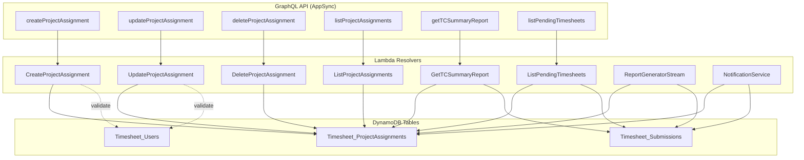

# Design Document: Multi-Supervisor Project Assignments

## Overview

This feature replaces the single `supervisorId` field on the Users table with a many-to-many relationship between employees, projects, and supervisors. A new `Timesheet_ProjectAssignments` DynamoDB table stores these mappings, and all dependent components (TC Summary report generator, ListPendingTimesheets resolver, Notification service, and stream-triggered report generation) are updated to query the new table instead of the Users table's `supervisorId-index` GSI.

The existing `supervisorId` field on the User type is retained as a deprecated attribute during the migration period to ensure backward compatibility.

### Key Design Decisions

1. **Separate table vs. embedded list**: A dedicated ProjectAssignments table was chosen over embedding assignment lists in the User record because it supports efficient GSI-based lookups by `employeeId`, `supervisorId`, and `projectId` independently, and avoids DynamoDB item size limits for users with many assignments.

2. **UUID-based assignmentId**: Each assignment gets a unique `assignmentId` as the partition key, keeping the table schema simple and avoiding composite key complexity. GSIs handle all access patterns.

3. **Deduplication at query time**: When an employee is assigned to the same supervisor through multiple projects, deduplication happens in the Lambda logic (using a set of employee IDs) rather than at the data layer. This keeps the data model honest (each assignment is a distinct record) while preventing duplicate rows in reports.

4. **Backward compatibility via deprecation**: The `supervisorId` field on User is kept as optional/deprecated rather than removed, allowing a gradual migration. All read paths switch to ProjectAssignments immediately; write paths continue accepting `supervisorId` without error.

## Architecture



### Data Flow for Supervisor Lookup (New)

1. **Before**: Lambda queries `Users` table `supervisorId-index` GSI → gets employee records → extracts `userId` list
2. **After**: Lambda queries `ProjectAssignments` table `supervisorId-index` GSI → gets assignment records → extracts unique `employeeId` set

This change applies to: TC Summary generation, ListPendingTimesheets, Notification service, and stream-triggered report generation.

### Data Flow for Stream-Triggered Reports (New)

1. Submission status changes to `Submitted` → DynamoDB Stream triggers ReportGeneratorStream Lambda
2. Lambda extracts `employeeId` from the stream record
3. Lambda queries `ProjectAssignments` table `employeeId-index` GSI → gets all assignments for that employee
4. Lambda extracts distinct `supervisorId` values from assignments
5. Lambda generates a TC Summary report for each distinct supervisor

## Components and Interfaces

### New Lambda Resolvers

#### CreateProjectAssignment
- **Handler**: `lambdas/project_assignments/CreateProjectAssignment/handler.py`
- **Trigger**: AppSync mutation `createProjectAssignment`
- **Auth**: `require_user_type(event, ["superadmin", "admin"])`
- **Input**: `CreateProjectAssignmentInput { employeeId!, projectId!, supervisorId! }`
- **Logic**:
  1. Validate `employeeId` exists in Users table
  2. Validate `projectId` exists in Projects table
  3. Validate `supervisorId` exists in Users table
  4. Check for duplicate `employeeId + projectId` combination via scan with filter on `employeeId-index`
  5. Generate UUID `assignmentId`, set `createdAt`/`createdBy` from caller identity
  6. Put item to ProjectAssignments table
- **Output**: `ProjectAssignment` type
- **Env vars**: `PROJECT_ASSIGNMENTS_TABLE`, `USERS_TABLE`, `PROJECTS_TABLE`

#### UpdateProjectAssignment
- **Handler**: `lambdas/project_assignments/UpdateProjectAssignment/handler.py`
- **Trigger**: AppSync mutation `updateProjectAssignment`
- **Auth**: `require_user_type(event, ["superadmin", "admin"])`
- **Input**: `UpdateProjectAssignmentInput { supervisorId, projectId }`
- **Logic**:
  1. Get existing assignment by `assignmentId`
  2. Validate any referenced IDs exist
  3. If `projectId` is changing, check for duplicate `employeeId + projectId`
  4. Update item with `updatedAt`/`updatedBy`
- **Output**: `ProjectAssignment` type
- **Env vars**: `PROJECT_ASSIGNMENTS_TABLE`, `USERS_TABLE`, `PROJECTS_TABLE`

#### DeleteProjectAssignment
- **Handler**: `lambdas/project_assignments/DeleteProjectAssignment/handler.py`
- **Trigger**: AppSync mutation `deleteProjectAssignment`
- **Auth**: `require_user_type(event, ["superadmin", "admin"])`
- **Input**: `assignmentId: ID!`
- **Logic**: Delete item from ProjectAssignments table by `assignmentId`
- **Output**: `Boolean!`
- **Env vars**: `PROJECT_ASSIGNMENTS_TABLE`

#### ListProjectAssignments
- **Handler**: `lambdas/project_assignments/ListProjectAssignments/handler.py`
- **Trigger**: AppSync query `listProjectAssignments`
- **Auth**: Any authenticated user (read-only)
- **Input**: `ProjectAssignmentFilterInput { employeeId, supervisorId, projectId }`
- **Logic**:
  - If `employeeId` provided → query `employeeId-index`
  - If `supervisorId` provided → query `supervisorId-index`
  - If `projectId` provided → query `projectId-index`
  - If no filter → scan (admin use case)
- **Output**: `[ProjectAssignment!]!`
- **Env vars**: `PROJECT_ASSIGNMENTS_TABLE`

### Modified Lambda Functions

#### Reports Stream Handler (`lambdas/reports/handler.py`)
- **Change**: Replace `_get_employee_supervisor_id()` (single user lookup) with `_get_employee_supervisors()` (ProjectAssignments `employeeId-index` query)
- **Change**: Loop over distinct supervisor IDs to generate TC Summary for each
- **New env var**: `PROJECT_ASSIGNMENTS_TABLE`

#### GetTCSummaryReport (`lambdas/reports/GetTCSummaryReport/handler.py`)
- **Change**: Inherits updated `_generate_tc_summary()` from `reports/handler.py` which now uses ProjectAssignments
- **New env var**: `PROJECT_ASSIGNMENTS_TABLE`

#### Reports Handler - `_get_supervised_employees()` (`lambdas/reports/handler.py`)
- **Change**: Query `ProjectAssignments` table `supervisorId-index` instead of `Users` table `supervisorId-index`
- **Change**: Extract unique `employeeId` set from assignments, then batch-get user details from Users table
- **New env var**: `PROJECT_ASSIGNMENTS_TABLE`

#### ListPendingTimesheets (`lambdas/reviews/ListPendingTimesheets/handler.py`)
- **Change**: Replace `_get_supervised_employee_ids()` to query `ProjectAssignments` table `supervisorId-index` instead of `Users` table `supervisorId-index`
- **Change**: Deduplicate employee IDs (an employee may appear in multiple assignments for the same supervisor)
- **New env var**: `PROJECT_ASSIGNMENTS_TABLE`

#### Notification Service (`lambdas/notifications/handler.py`)
- **Change**: Replace `_get_supervised_employees()` to query `ProjectAssignments` table `supervisorId-index`
- **Change**: After getting assignment records, batch-get user details from Users table for employee names/emails
- **Change**: Skip sending TC Summary email when a tech lead has no project assignments
- **New env var**: `PROJECT_ASSIGNMENTS_TABLE`

### Shared Utility: `get_supervised_employee_ids()`

To avoid duplicating the ProjectAssignments query logic across multiple Lambdas, a shared utility function will be added:

```python
# lambdas/shared/project_assignments.py

def get_supervised_employee_ids(project_assignments_table_name, supervisor_id):
    """Query ProjectAssignments table to get unique employee IDs for a supervisor.
    
    Args:
        project_assignments_table_name: DynamoDB table name
        supervisor_id: The supervisor's userId
    
    Returns:
        List of unique employee ID strings
    """
```

This function will be used by: reports handler, ListPendingTimesheets, and notification service.

### GraphQL Schema Changes

```graphql
# New type
type ProjectAssignment @aws_api_key @aws_cognito_user_pools {
  assignmentId: ID!
  employeeId: ID!
  projectId: ID!
  supervisorId: ID!
  createdAt: AWSDateTime!
  createdBy: ID
  updatedAt: AWSDateTime
  updatedBy: ID
}

# New inputs
input CreateProjectAssignmentInput {
  employeeId: ID!
  projectId: ID!
  supervisorId: ID!
}

input UpdateProjectAssignmentInput {
  supervisorId: ID
  projectId: ID
}

input ProjectAssignmentFilterInput {
  employeeId: ID
  supervisorId: ID
  projectId: ID
}

# New query
listProjectAssignments(filter: ProjectAssignmentFilterInput): [ProjectAssignment!]!

# New mutations
createProjectAssignment(input: CreateProjectAssignmentInput!): ProjectAssignment!
updateProjectAssignment(assignmentId: ID!, input: UpdateProjectAssignmentInput!): ProjectAssignment!
deleteProjectAssignment(assignmentId: ID!): Boolean!
```

The existing `supervisorId` field on `User`, `CreateUserInput`, and `UpdateUserInput` remains as-is (optional) for backward compatibility.

### CDK Infrastructure Changes

#### DynamoDB Stack (`colabs_pipeline_cdk/stack/dynamodb_stack.py`)
- Add `project_assignments_table` with:
  - Partition key: `assignmentId` (String)
  - GSI `employeeId-index`: partition key `employeeId` (String)
  - GSI `supervisorId-index`: partition key `supervisorId` (String)
  - GSI `projectId-index`: partition key `projectId` (String)
  - Billing: PAY_PER_REQUEST
  - Table name: `Timesheet_ProjectAssignments-{env}`
- Export table name and ARN to SSM under `/timesheet/{env}/dynamodb/project_assignments/`

#### Environment Config (`colabs_pipeline_cdk/environment.py`)
- Add `"project_assignments": "Timesheet_ProjectAssignments"` to `TIMESHEET_TABLE_NAMES`

#### Lambda Stack (`colabs_pipeline_cdk/stack/lambda_stack.py`)
- Import the new table in `_import_resources()`
- Create 4 new Lambda functions for CRUD operations with AppSync resolvers
- Add `PROJECT_ASSIGNMENTS_TABLE` env var and read permissions to: reports stream handler, GetTCSummaryReport, GetProjectSummaryReport, ListPendingTimesheets, notification service
- Grant read/write on ProjectAssignments table to CRUD Lambdas
- Grant read on Users and Projects tables to Create/Update Lambdas (for validation)

## Data Models

### ProjectAssignment Item (DynamoDB)

| Attribute     | Type   | Description                          |
|---------------|--------|--------------------------------------|
| assignmentId  | String | Partition key, UUID                  |
| employeeId    | String | FK to Users table                    |
| projectId     | String | FK to Projects table                 |
| supervisorId  | String | FK to Users table (the tech lead)    |
| createdAt     | String | ISO 8601 datetime                    |
| createdBy     | String | userId of the creator                |
| updatedAt     | String | ISO 8601 datetime (nullable)         |
| updatedBy     | String | userId of the last updater (nullable)|

### GSI Access Patterns

| GSI Name            | Partition Key  | Use Case                                      |
|---------------------|----------------|-----------------------------------------------|
| employeeId-index    | employeeId     | Find all supervisors/projects for an employee  |
| supervisorId-index  | supervisorId   | Find all employees under a supervisor          |
| projectId-index     | projectId      | Find all assignments for a project             |

### Uniqueness Constraint

The combination of `(employeeId, projectId)` must be unique. Since DynamoDB doesn't support composite unique constraints natively, this is enforced at the application layer:
- On `createProjectAssignment`: query `employeeId-index` with the given `employeeId`, then filter results for matching `projectId`. If found, return a duplicate error.
- On `updateProjectAssignment`: if `projectId` is being changed, perform the same check.


## Correctness Properties

*A property is a characteristic or behavior that should hold true across all valid executions of a system — essentially, a formal statement about what the system should do. Properties serve as the bridge between human-readable specifications and machine-verifiable correctness guarantees.*

### Property 1: Create assignment round-trip

*For any* valid `employeeId`, `projectId`, and `supervisorId` combination, creating a ProjectAssignment and then retrieving it by `assignmentId` should return a record containing the same `employeeId`, `projectId`, `supervisorId`, and non-null `createdAt` and `createdBy` fields.

**Validates: Requirements 1.1, 2.1**

### Property 2: Update preserves unchanged fields

*For any* existing ProjectAssignment and any valid `UpdateProjectAssignmentInput` that changes only a subset of mutable fields (`supervisorId`, `projectId`), the returned assignment should reflect the updated fields while all other fields remain unchanged, and `updatedAt`/`updatedBy` should be set.

**Validates: Requirements 2.2**

### Property 3: Delete removes assignment

*For any* existing ProjectAssignment, calling `deleteProjectAssignment` with its `assignmentId` should return `true`, and a subsequent `listProjectAssignments` filtered by that `employeeId` should not contain the deleted `assignmentId`.

**Validates: Requirements 2.3**

### Property 4: Filter returns only matching records

*For any* set of ProjectAssignment records and any single filter parameter (`employeeId`, `supervisorId`, or `projectId`), all records returned by `listProjectAssignments` should have the filtered field equal to the provided value.

**Validates: Requirements 2.4**

### Property 5: Duplicate employeeId+projectId rejected

*For any* existing ProjectAssignment with a given `employeeId` and `projectId`, attempting to create another assignment with the same `employeeId` and `projectId` (regardless of `supervisorId`) should return an error, and the total number of assignments should remain unchanged.

**Validates: Requirements 2.5**

### Property 6: Non-existent referenced IDs rejected

*For any* `employeeId`, `projectId`, or `supervisorId` that does not exist in the respective Users or Projects table, calling `createProjectAssignment` with that ID should return a validation error and no assignment should be created.

**Validates: Requirements 2.6**

### Property 7: Non-admin users rejected from mutations

*For any* user whose `userType` is not `superadmin` or `admin`, calling `createProjectAssignment`, `updateProjectAssignment`, or `deleteProjectAssignment` should raise a `ForbiddenError` and leave the data unchanged.

**Validates: Requirements 2.7**

### Property 8: Supervised employee lookup returns correct unique set

*For any* set of ProjectAssignment records and any `supervisorId`, the `get_supervised_employee_ids()` function should return a set of `employeeId` values that exactly matches the distinct `employeeId` values from assignments where `supervisorId` equals the given value. No duplicates should be present even if the same employee appears in multiple assignments for the same supervisor.

**Validates: Requirements 3.1, 3.3, 4.1, 4.3, 5.1**

### Property 9: Stream handler generates report per distinct supervisor

*For any* employee with N distinct supervisors in their ProjectAssignment records, when a timesheet submission status changes to `Submitted`, the stream handler should invoke TC Summary generation exactly N times — once per distinct `supervisorId`.

**Validates: Requirements 6.1, 6.2**

### Property 10: Backward compatibility — supervisorId accepted on user mutations

*For any* valid `CreateUserInput` or `UpdateUserInput` that includes a `supervisorId` value, the mutation should succeed without error, and the returned User should contain the provided `supervisorId`.

**Validates: Requirements 7.4**

## Error Handling

### Assignment CRUD Errors

| Error Condition | Response | HTTP-equivalent |
|---|---|---|
| Duplicate `employeeId + projectId` on create | `"Assignment already exists for employee '{employeeId}' on project '{projectId}'"` | 409 Conflict |
| Non-existent `employeeId` on create/update | `"Employee '{employeeId}' not found"` | 400 Bad Request |
| Non-existent `projectId` on create/update | `"Project '{projectId}' not found"` | 400 Bad Request |
| Non-existent `supervisorId` on create/update | `"Supervisor '{supervisorId}' not found"` | 400 Bad Request |
| Non-existent `assignmentId` on update/delete | `"Assignment '{assignmentId}' not found"` | 404 Not Found |
| Unauthorized user type | `ForbiddenError("User type '{userType}' is not authorized. Allowed types: ['superadmin', 'admin']")` | 403 Forbidden |

### Report and Query Errors

| Error Condition | Behavior |
|---|---|
| Tech lead has no project assignments | TC Summary returns `None`/empty; notification service skips email; no error raised |
| Employee has no project assignments (stream trigger) | No TC Summary reports generated; logged as info |
| ProjectAssignments table query fails | Lambda logs error with full context and re-raises; AppSync returns GraphQL error |

### Backward Compatibility Errors

| Error Condition | Behavior |
|---|---|
| `supervisorId` provided on `createUser`/`updateUser` | Accepted silently, stored on User record as before |
| `supervisorId` not provided on `createUser`/`updateUser` | Accepted (field is optional), no default value set |

## Testing Strategy

### Property-Based Testing

Property-based tests use the `hypothesis` library (Python) with a minimum of 100 iterations per property. Each test is tagged with a comment referencing the design property.

Tests target the pure logic functions extracted from Lambda handlers:

1. **Assignment CRUD properties (Properties 1-7)**: Test the Lambda handler logic with mocked DynamoDB. Generate random valid/invalid inputs using `hypothesis` strategies for UUIDs, strings, and user types.

2. **Supervised employee lookup (Property 8)**: Test `get_supervised_employee_ids()` with generated lists of assignment records. Verify the output is a deduplicated set matching expected employee IDs.

3. **Stream handler supervisor fan-out (Property 9)**: Test `_get_employee_supervisors()` with generated assignment lists. Verify the count of distinct supervisors matches the number of report generation calls.

4. **Backward compatibility (Property 10)**: Test that user mutation handlers accept `supervisorId` in input without error.

Each property-based test must:
- Run a minimum of 100 iterations
- Reference its design property in a comment tag
- Tag format: `# Feature: multi-supervisor-project-assignments, Property {N}: {title}`

### Unit Testing

Unit tests complement property tests for specific examples and edge cases:

- **Edge cases**: Empty assignment list for a supervisor, single assignment, employee with assignments to same supervisor via multiple projects
- **CDK infrastructure**: Verify synthesized CloudFormation contains the ProjectAssignments table with correct partition key, GSIs, billing mode, and SSM exports (Requirements 1.2-1.6, 8.1-8.4)
- **GraphQL schema**: Verify new types, inputs, queries, and mutations are present; verify `supervisorId` remains on User type (Requirements 7.3)
- **Integration points**: Test that modified Lambda handlers (reports, ListPendingTimesheets, notifications) correctly use `PROJECT_ASSIGNMENTS_TABLE` env var and query the right GSI
- **Error conditions**: Duplicate assignment creation, non-existent ID validation, unauthorized access attempts

### Test File Organization

```
tests/
└── unit/
    ├── test_project_assignments_crud.py      # Properties 1-7
    ├── test_supervised_employee_lookup.py     # Property 8
    ├── test_stream_handler_fanout.py          # Property 9
    ├── test_backward_compatibility.py         # Property 10
    └── test_project_assignments_cdk.py        # CDK infrastructure checks
```
