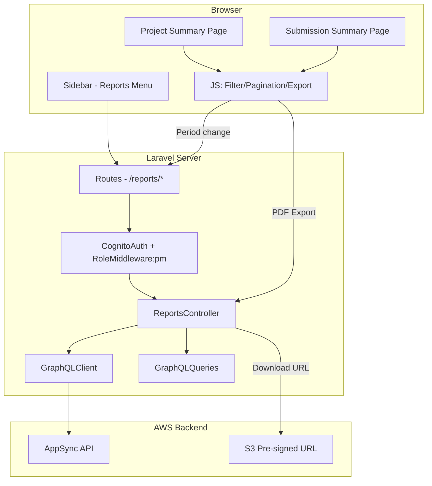

# Design Document: PM Reports Section

## Overview

The PM Reports Section adds two report pages (Project Summary and Submission Summary) to the TimeFlow frontend, accessible only to users with userType `user` and role `Tech_Lead` or `Project_Manager`. Admin and superadmin access will be handled in a separate spec. The feature extends the existing sidebar navigation with a collapsible "Reports" menu group and introduces a new `ReportsController` that queries the existing GraphQL API for project/submission data, computes utilization and chargeability metrics, and renders Blade templates with filterable data tables, colored progress bars, pagination, and PDF export via pre-signed S3 URLs.

The implementation follows the established patterns in the codebase: server-side rendered Blade views extending `layouts.app`, a controller using `GraphQLClient` for API calls, centralized query constants in `GraphQLQueries`, and client-side JavaScript for filtering/pagination without full page reloads.

### Key Design Decisions

1. **Server-side data loading, client-side filtering**: Initial data is loaded server-side via the controller (consistent with Dashboard/History patterns). Search filtering and pagination are handled client-side in JavaScript to avoid round-trips for simple text filtering. Period selection triggers a server-side re-fetch since it changes the underlying dataset.
2. **Extend existing RoleMiddleware**: Rather than creating a new middleware, we add a `pm` role level to the existing `RoleMiddleware` that permits users with userType `user` and role `Tech_Lead` or `Project_Manager`.
3. **Reuse GraphQLQueries constants**: New query constants (`LIST_ALL_SUBMISSIONS`, `GET_PROJECT_SUMMARY_REPORT`, `GET_TC_SUMMARY_REPORT`) are added to the existing `GraphQLQueries` class.
4. **Single controller**: Both report pages are served by one `ReportsController` with separate action methods.

## Architecture



### Request Flow

1. User clicks a report link in the sidebar
2. Laravel routes the request through `cognito.auth` and `role:pm` middleware
3. `ReportsController` fetches data via `GraphQLClient` using queries from `GraphQLQueries`
4. Controller computes utilization/chargeability metrics and passes data to Blade view
5. Blade template renders the page with filter bar, data table, progress bars, and pagination
6. Client-side JS handles search filtering, pagination, and PDF export button clicks
7. PDF export triggers an AJAX call to a controller endpoint that returns the pre-signed S3 URL

## Components and Interfaces

### 1. Sidebar Update (`components/sidebar.blade.php`)

The existing Tech_Lead/Project_Manager conditional block in the sidebar gets a collapsible Reports menu with two sub-items. The expand/collapse behavior uses a small inline JS toggle and CSS transitions.

```php
// Inserted between Timesheet and Settings nav items, inside the role conditional
@if(in_array($role, ['Tech_Lead', 'Project_Manager']) && $userType === 'user')
    <li class="nav-group">
        <button class="nav-group-toggle" aria-expanded="false|true">
            <svg><!-- document/chart icon --></svg>
            Reports
            <svg><!-- chevron icon --></svg>
        </button>
        <ul class="nav-group-items">
            <li><a href="/reports/project-summary">Project Summary</a></li>
            <li><a href="/reports/submission-summary">Submission Summary</a></li>
        </ul>
    </li>
@endif
```

### 2. RoleMiddleware Extension (`Middleware/RoleMiddleware.php`)

Add a `pm` role level to the existing `isAuthorized` method:

```php
'pm' => $userType === 'user'
        && in_array($user['role'] ?? '', ['Tech_Lead', 'Project_Manager'], true),
```

### 3. ReportsController (`Controllers/ReportsController.php`)

```php
class ReportsController extends Controller
{
    protected GraphQLClient $graphql;

    public function __construct(GraphQLClient $graphql);

    // GET /reports/project-summary
    public function projectSummary(Request $request): View|RedirectResponse;

    // GET /reports/submission-summary
    public function submissionSummary(Request $request): View|RedirectResponse;

    // GET /reports/project-summary/export (AJAX)
    public function exportProjectPdf(Request $request): JsonResponse;

    // GET /reports/submission-summary/export (AJAX)
    public function exportSubmissionPdf(Request $request): JsonResponse;
}
```

**`projectSummary` logic:**
1. Fetch current period via `getCurrentPeriod`
2. Fetch all periods via `listTimesheetPeriods`
3. Fetch projects via `listProjects`
4. Fetch all submissions for the selected period via `listAllSubmissions` (to compute charged hours per project)
5. Compute utilization = (charged hours / planned hours) × 100 per project
6. Pass data to `pages.reports.project-summary` view

**`submissionSummary` logic:**
1. Fetch current period via `getCurrentPeriod`
2. Fetch all periods via `listTimesheetPeriods`
3. Fetch all submissions for the selected period via `listAllSubmissions`
4. Fetch user list via `listUsers` to map employee IDs to names
5. Compute chargeability = (chargeable hours / total hours) × 100 per employee
6. Pass data to `pages.reports.submission-summary` view

**`exportProjectPdf` / `exportSubmissionPdf` logic:**
1. Accept `periodId` from request
2. Call `getProjectSummaryReport` or `getTCSummaryReport` via GraphQL
3. Return JSON with the pre-signed download URL

### 4. GraphQLQueries Additions

New constants added to `GraphQLQueries.php`:

```php
public const LIST_ALL_SUBMISSIONS = <<<'GRAPHQL'
query ListAllSubmissions($filter: AdminSubmissionFilterInput) {
    listAllSubmissions(filter: $filter) {
        submissionId
        periodId
        employeeId
        status
        entries { entryId projectCode totalHours }
        totalHours
        chargeableHours
    }
}
GRAPHQL;

public const GET_PROJECT_SUMMARY_REPORT = <<<'GRAPHQL'
query GetProjectSummaryReport($periodId: ID!) {
    getProjectSummaryReport(periodId: $periodId) {
        url
        expiresAt
    }
}
GRAPHQL;

public const GET_TC_SUMMARY_REPORT = <<<'GRAPHQL'
query GetTCSummaryReport($techLeadId: ID!, $periodId: ID!) {
    getTCSummaryReport(techLeadId: $techLeadId, periodId: $periodId) {
        url
        expiresAt
    }
}
GRAPHQL;

public const LIST_USERS = <<<'GRAPHQL'
query ListUsers($filter: UserFilterInput) {
    listUsers(filter: $filter) {
        items {
            userId
            fullName
            role
            status
        }
        nextToken
    }
}
GRAPHQL;
```

### 5. Routes (`routes/web.php`)

```php
Route::middleware('cognito.auth')->group(function () {
    // ... existing routes ...

    // PM Reports (role-restricted)
    Route::middleware('role:pm')->group(function () {
        Route::get('/reports/project-summary', [ReportsController::class, 'projectSummary']);
        Route::get('/reports/submission-summary', [ReportsController::class, 'submissionSummary']);
        Route::get('/reports/project-summary/export', [ReportsController::class, 'exportProjectPdf']);
        Route::get('/reports/submission-summary/export', [ReportsController::class, 'exportSubmissionPdf']);
    });
});
```

### 6. Blade Views

**`pages/reports/project-summary.blade.php`**
- Extends `layouts.app`
- Breadcrumb: "Reports / Project Summary"
- Title: "Project Summary Report" with Export PDF button
- Filter bar: search input, period dropdown, status dropdown
- Data table: PROJECT CODE, PROJECT NAME, PLANNED HOURS, CHARGED HOURS, UTILIZATION (%)
- Each utilization cell contains a colored progress bar
- Totals row at bottom
- Pagination controls below table

**`pages/reports/submission-summary.blade.php`**
- Extends `layouts.app`
- Breadcrumb: "Reports / Submission Summary"
- Title: "Submission Summary Report" with Export PDF button
- Filter bar: search input, period dropdown, status dropdown
- Data table: NAME, CHARGEABLE HOURS, TOTAL HOURS, CURRENT PERIOD CHARGEABILITY (%), YTD CHARGEABILITY (%)
- Each chargeability cell contains a colored progress bar
- Totals row at bottom
- Pagination controls below table

### 7. CSS Additions (`public/css/app.css`)

New styles appended to the existing stylesheet:
- `.nav-group`, `.nav-group-toggle`, `.nav-group-items` — collapsible sidebar menu
- `.progress-bar`, `.progress-bar-fill` — colored progress bars
- `.progress-green`, `.progress-yellow`, `.progress-red` — color variants
- `.breadcrumb` — breadcrumb navigation
- `.totals-row` — bold totals row styling
- `.pagination` — pagination controls
- `.btn-export` — export button variant

### 8. JavaScript (`public/js/reports.js`)

Client-side module handling:
- Search input filtering (case-insensitive text match on table rows)
- Pagination (show N rows per page, update page controls)
- Period dropdown change → form submission or AJAX reload
- Export PDF button → AJAX call to export endpoint → trigger browser download
- Loading state management for export button

## Data Models

### View Data: Project Summary

```
ProjectSummaryRow {
    projectCode: string
    projectName: string
    plannedHours: float
    chargedHours: float       // sum of entry totalHours for this project in the period
    utilizationPercent: float  // (chargedHours / plannedHours) * 100
    status: string
}
```

Computed server-side by cross-referencing `listProjects` items with `listAllSubmissions` entries grouped by `projectCode`.

### View Data: Submission Summary

```
SubmissionSummaryRow {
    employeeId: string
    employeeName: string       // resolved via listUsers
    chargeableHours: float     // from submission.chargeableHours
    totalHours: float          // from submission.totalHours
    currentChargeability: float // (chargeableHours / totalHours) * 100
    ytdChargeability: float    // from EmployeePerformance if available, else computed
    status: string             // submission status
}
```

### View Data: Totals

```
ReportTotals {
    totalPlannedHours: float
    totalChargedHours: float
    overallUtilization: float   // (totalCharged / totalPlanned) * 100
    totalChargeableHours: float
    totalTotalHours: float
    overallChargeability: float // (totalChargeable / totalTotal) * 100
}
```

### Existing Types Used (from GraphQL schema)

- `Project` — projectCode, projectName, plannedHours, status
- `TimesheetSubmission` — employeeId, entries, totalHours, chargeableHours
- `TimesheetEntry` — projectCode, totalHours
- `TimesheetPeriod` — periodId, startDate, endDate, periodString
- `User` — userId, fullName
- `ReportDownloadUrl` — url, expiresAt


## Correctness Properties

*A property is a characteristic or behavior that should hold true across all valid executions of a system — essentially, a formal statement about what the system should do. Properties serve as the bridge between human-readable specifications and machine-verifiable correctness guarantees.*

### Property 1: Sidebar visibility is determined by role

*For any* user with a given role and userType, the Reports menu item is rendered in the sidebar if and only if the user's userType is `user` and role is `Tech_Lead` or `Project_Manager`. For all other users (including `Employee` role), the Reports menu item must not be rendered.

**Validates: Requirements 1.1, 1.8**

### Property 2: Route authorization permits only qualifying roles

*For any* user attempting to access a `/reports/*` route, the request succeeds if and only if the user's userType is `user` and role is `Tech_Lead` or `Project_Manager`. All other authenticated users are redirected to the dashboard.

**Validates: Requirements 2.2**

### Property 3: Utilization and chargeability percentage calculation

*For any* non-negative pair (part, whole) where whole > 0, the computed percentage equals (part / whole) × 100. When whole is 0, the percentage is 0. This applies to both project utilization (chargedHours / plannedHours) and employee chargeability (chargeableHours / totalHours).

**Validates: Requirements 3.6, 4.6**

### Property 4: Progress bar color assignment by threshold

*For any* percentage value, the assigned color class is: yellow when the value is below 50, green when the value is between 50 and 100 (inclusive), and red when the value is above 100. This rule applies uniformly to both Utilization_Bar and Chargeability_Bar components.

**Validates: Requirements 3.7, 4.7, 6.3**

### Property 5: Totals row equals sum of individual rows

*For any* list of report rows (project or submission), the totals row's aggregate values (planned hours, charged hours, chargeable hours, total hours) equal the sum of the corresponding values across all individual rows, and the overall percentage equals (sum of part / sum of whole) × 100.

**Validates: Requirements 3.8, 4.8**

### Property 6: Search filter returns only matching rows

*For any* search string and list of items (projects or employees), the filtered result contains exactly those items where the searchable field (project code, project name, or employee name) contains the search string as a case-insensitive substring. The filtered set is always a subset of the original set.

**Validates: Requirements 3.9, 4.9**

### Property 7: Pagination displays correct counts and pages

*For any* list of N items and page size P, the pagination shows ceil(N/P) total pages, each page displays at most P items, and the displayed count text accurately reflects the number of currently visible items out of the total.

**Validates: Requirements 3.11, 4.11**

### Property 8: Active sidebar state matches current URL

*For any* URL matching `/reports/project-summary` or `/reports/submission-summary`, the Reports menu group has the active class and is expanded, and the specific sub-item corresponding to the current URL has the active class.

**Validates: Requirements 1.5, 1.6, 1.7**

## Error Handling

### API Errors During Page Load
- If `GraphQLClient` throws an `AuthenticationException` (401/403), the controller redirects to `/login` with an auth error message (consistent with existing `DashboardController` pattern).
- If `GraphQLClient` throws a general `Exception`, the controller renders the report view with an `$error` variable and a "Retry" button, matching the existing error pattern in dashboard/history views.

### API Errors During PDF Export
- The export endpoints return JSON. On success: `{ success: true, url: "..." }`. On failure: `{ success: false, error: "..." }`.
- Client-side JS displays the error message in a notification toast and re-enables the Export PDF button.

### Division by Zero
- When `plannedHours` is 0 (utilization) or `totalHours` is 0 (chargeability), the percentage is displayed as `0.0%` and the progress bar is empty with no color class.

### Empty Data
- When no projects or submissions exist for the selected period, the table body shows an empty state message: "No data found for the selected period."
- Pagination shows "Showing 0 of 0" and no page controls.

### Missing User Data
- If `listUsers` cannot resolve an `employeeId` to a name, the submission summary row displays the raw `employeeId` as a fallback.

## Testing Strategy

### Unit Tests (PHPUnit)

Unit tests cover specific examples, edge cases, and integration points:

- **ReportsController**: Test that `projectSummary` and `submissionSummary` actions return correct views with expected data when GraphQL returns mock responses. Test error handling when GraphQL throws exceptions.
- **RoleMiddleware**: Test the `pm` role level permits Tech_Lead and Project_Manager (with userType `user`) and rejects Employee users, admin, and superadmin.
- **Route registration**: Verify `/reports/project-summary` and `/reports/submission-summary` routes exist with correct middleware.
- **Edge cases**: Division by zero for utilization/chargeability, empty project/submission lists, missing user names.

### Property-Based Tests (PHPUnit + custom generators)

Since this is a PHP/Laravel project, property-based tests use PHPUnit with data providers generating randomized inputs. Each test runs a minimum of 100 iterations.

Each property test references its design document property:

- **Feature: pm-reports-section, Property 1: Sidebar visibility is determined by role** — Generate random user role/userType combinations, render the sidebar partial, assert Reports menu presence matches the role predicate.
- **Feature: pm-reports-section, Property 2: Route authorization permits only qualifying roles** — Generate random user sessions, dispatch requests to report routes, assert redirect vs. 200 matches the authorization predicate.
- **Feature: pm-reports-section, Property 3: Utilization and chargeability percentage calculation** — Generate random (part, whole) float pairs, compute percentage, assert result equals (part/whole)*100 or 0 when whole is 0.
- **Feature: pm-reports-section, Property 4: Progress bar color assignment by threshold** — Generate random percentage values (0–200), apply the color function, assert correct color class based on thresholds.
- **Feature: pm-reports-section, Property 5: Totals row equals sum of individual rows** — Generate random lists of report rows with random hour values, compute totals, assert totals equal sums.
- **Feature: pm-reports-section, Property 6: Search filter returns only matching rows** — Generate random search strings and item lists, apply filter, assert all results contain the search string and no non-matching items are included.
- **Feature: pm-reports-section, Property 7: Pagination displays correct counts and pages** — Generate random item counts and page sizes, compute pagination metadata, assert page count and item counts are correct.
- **Feature: pm-reports-section, Property 8: Active sidebar state matches current URL** — Generate report URLs, render sidebar, assert correct active classes on menu group and sub-items.

### Testing Configuration

- Property-based tests: minimum 100 iterations per property via PHPUnit data providers with randomized inputs
- Each property test tagged with a comment: `// Feature: pm-reports-section, Property N: {title}`
- Unit tests focus on concrete examples and edge cases; property tests focus on universal correctness across all inputs
