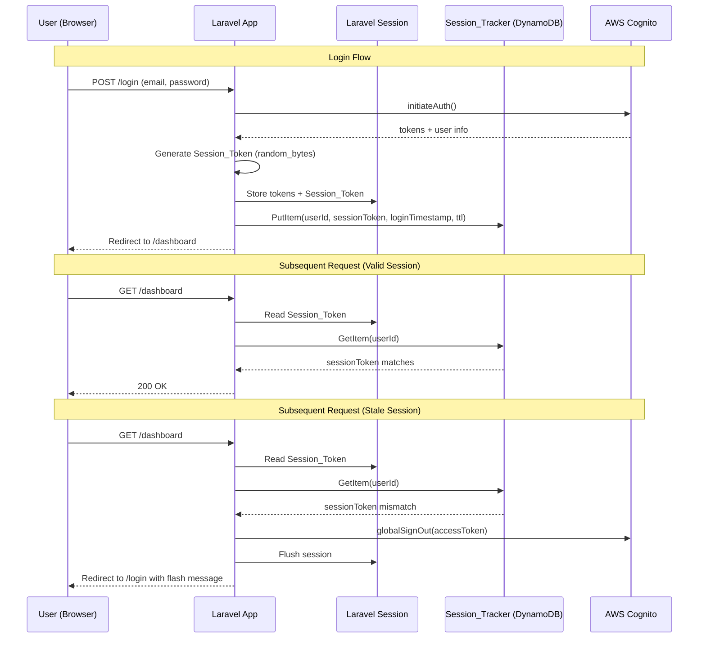
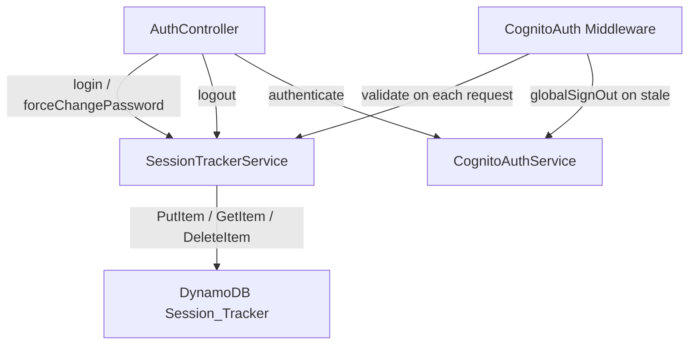

# Design Document: Single-Device Login

## Overview

This feature enforces single-device login for TimeFlow user accounts. When a user logs in on a new device or browser, any existing session on a previous device is invalidated. The mechanism uses a server-side session token stored in a DynamoDB `Session_Tracker` table, checked on every authenticated request by the existing `CognitoAuth` middleware.

The approach is deliberately simple: on login, generate a random token, store it in both the Laravel session and DynamoDB (keyed by user ID). On each request, the middleware compares the session's token against DynamoDB. A mismatch means the user logged in elsewhere, so the stale session is flushed and the user is redirected to login with an explanatory message.

### Design Rationale

- **DynamoDB over Cognito-only**: Cognito's `globalSignOut` revokes refresh tokens but doesn't immediately invalidate access tokens (they remain valid until expiry, typically 1 hour). A server-side check gives instant enforcement.
- **Fail-open on DynamoDB outage**: If the Session_Tracker is unreachable, the system allows the request through rather than locking users out. This trades brief enforcement gaps for availability.
- **No Lambda required**: The session validation runs entirely within the Laravel middleware, keeping the architecture simple and avoiding additional infrastructure.

## Architecture



### Component Interaction



## Components and Interfaces

### 1. SessionTrackerService (New)

A new Laravel service class at `frontend/app/Services/SessionTrackerService.php` that encapsulates all DynamoDB interactions for session tracking.

```php
class SessionTrackerService
{
    /**
     * Write or overwrite the active session token for a user.
     * @param string $userId  Cognito sub (user ID)
     * @param string $sessionToken  Cryptographically random token
     * @return void
     * @throws \Exception on DynamoDB failure (caller handles)
     */
    public function putSession(string $userId, string $sessionToken): void;

    /**
     * Retrieve the active session token for a user.
     * @param string $userId
     * @return string|null  The stored sessionToken, or null if not found
     * @throws \Exception on DynamoDB failure (caller handles)
     */
    public function getSessionToken(string $userId): ?string;

    /**
     * Delete the session tracker entry for a user.
     * @param string $userId
     * @return void
     * @throws \Exception on DynamoDB failure (caller handles)
     */
    public function deleteSession(string $userId): void;
}
```

Configuration: reads the table name from `config('services.session_tracker.table')`, which maps to the `SESSION_TRACKER_TABLE` environment variable.

### 2. AuthController (Modified)

Changes to `frontend/app/Http/Controllers/AuthController.php`:

- **`login()` method**: After successful authentication and storing tokens in session, generate a `Session_Token` via `bin2hex(random_bytes(32))`, store it in the Laravel session under key `sessionToken`, and call `SessionTrackerService::putSession()`. Wrap the DynamoDB call in try/catch — log and continue on failure.
- **`forceChangePassword()` method**: Same token generation and storage logic after successful challenge response.
- **`logout()` method**: Call `SessionTrackerService::deleteSession()` before flushing the session. Wrap in try/catch — log and continue on failure.

### 3. CognitoAuth Middleware (Modified)

Changes to `frontend/app/Http/Middleware/CognitoAuth.php`:

- After token validation/refresh succeeds, retrieve `sessionToken` from the Laravel session and `userId` from `session('user.userId')`.
- Call `SessionTrackerService::getSessionToken($userId)`.
- If the returned token does not match the session's token: call `CognitoAuthService::globalSignOut()` with the access token, flush the session, redirect to `/login` with a flash message.
- If DynamoDB is unreachable (exception), log the error and allow the request to proceed (fail-open).
- If token refresh failed and session was already flushed, skip session tracker validation entirely.

### 4. DynamoDB Session_Tracker Table (New CDK)

Added to the existing `TimesheetDynamoDBStack` in `colabs_pipeline_cdk/stack/dynamodb_stack.py`.

### 5. Login View (Modified)

Update `frontend/resources/views/pages/login.blade.php` to display a `session('stale_session')` flash message using the existing `alert-error` styling.

## Data Models

### Session_Tracker DynamoDB Table

| Attribute       | Type   | Description                                      |
|----------------|--------|--------------------------------------------------|
| `userId`       | String | Partition key. Cognito `sub` (UUID).             |
| `sessionToken` | String | Cryptographically random hex string (64 chars).  |
| `loginTimestamp`| String | ISO 8601 timestamp of when the session was created. |
| `ttl`          | Number | Unix epoch timestamp, 30 days from login. DynamoDB TTL attribute. |

Table configuration:
- Table name: `Timesheet_SessionTracker_{env}` (follows existing naming convention)
- Billing mode: PAY_PER_REQUEST (on-demand)
- TTL enabled on `ttl` attribute
- No GSIs needed (all access is by `userId` partition key)
- Removal policy: DESTROY for dev, RETAIN for staging/prod

### Session Data (Laravel Session)

New key added to the existing Laravel session:

| Key             | Type   | Description                                     |
|----------------|--------|-------------------------------------------------|
| `sessionToken` | String | The same 64-char hex token stored in DynamoDB.  |


## Correctness Properties

*A property is a characteristic or behavior that should hold true across all valid executions of a system — essentially, a formal statement about what the system should do. Properties serve as the bridge between human-readable specifications and machine-verifiable correctness guarantees.*

### Property 1: Session token generation on any auth flow

*For any* successful authentication flow (login or force-change-password), the Laravel session SHALL contain a `sessionToken` value that is a non-empty, 64-character hexadecimal string.

**Validates: Requirements 1.1, 2.1**

### Property 2: Session token round-trip persistence

*For any* successful authentication flow and any user ID, the `sessionToken` stored in the Laravel session SHALL equal the `sessionToken` retrieved from the Session_Tracker DynamoDB table for that user ID, and the record SHALL contain a valid `loginTimestamp` and a `ttl` value approximately 30 days in the future.

**Validates: Requirements 1.2, 2.2, 5.2, 5.3**

### Property 3: Session token overwrite on re-login

*For any* user who authenticates twice in sequence, the Session_Tracker SHALL contain only the session token from the second authentication, and the token from the first authentication SHALL no longer be retrievable.

**Validates: Requirements 1.3**

### Property 4: Matching session token allows request

*For any* authenticated request where the `sessionToken` in the Laravel session matches the `sessionToken` in the Session_Tracker for that user, the CognitoAuth middleware SHALL allow the request to proceed to the next handler.

**Validates: Requirements 3.2**

### Property 5: Mismatched session token terminates session

*For any* authenticated request where the `sessionToken` in the Laravel session does not match the `sessionToken` in the Session_Tracker for that user, the CognitoAuth middleware SHALL call `globalSignOut` with the stale access token, flush the Laravel session, and redirect to `/login` with a stale-session flash message.

**Validates: Requirements 3.3, 3.4, 6.1**

### Property 6: Logout deletes session tracker entry

*For any* user who logs out via the Auth_Controller, the Session_Tracker SHALL no longer contain an entry for that user's ID.

**Validates: Requirements 4.1**

### Property 7: Token refresh preserves session token (Invariant)

*For any* authenticated request where the access token is expired and a token refresh succeeds, the `sessionToken` in the Laravel session SHALL remain unchanged after the refresh operation.

**Validates: Requirements 7.1**

### Property 8: Fail-open on DynamoDB unavailability

*For any* authenticated request where the Session_Tracker DynamoDB table is unreachable (throws an exception), the CognitoAuth middleware SHALL allow the request to proceed without flushing the session.

**Validates: Requirements 8.1**

## Error Handling

| Scenario | Component | Behavior |
|----------|-----------|----------|
| DynamoDB unreachable during login | AuthController | Log error, proceed with login. Session token is stored in Laravel session but not in DynamoDB. Next request will fail-open until DynamoDB recovers. |
| DynamoDB unreachable during request validation | CognitoAuth Middleware | Log error, allow request to proceed (fail-open). |
| DynamoDB unreachable during logout | AuthController | Log error, continue with session flush and Cognito sign-out. The DynamoDB record will be cleaned up by TTL (30 days). |
| `globalSignOut` fails on stale session detection | CognitoAuth Middleware | Log error, still flush the Laravel session and redirect to login. The Cognito tokens will expire naturally. |
| Session missing `sessionToken` key (legacy session) | CognitoAuth Middleware | Treat as no session token — skip validation and allow request. This handles sessions created before the feature was deployed. |
| Session missing `user.userId` | CognitoAuth Middleware | Skip session tracker validation (cannot look up without userId). |

## Testing Strategy

### Unit Tests

Unit tests verify specific scenarios and edge cases using PHPUnit (already configured in the Laravel project):

- Login stores a 64-char hex `sessionToken` in the session
- Force-change-password stores a `sessionToken` in the session
- Login calls `SessionTrackerService::putSession()` with correct userId and token
- Logout calls `SessionTrackerService::deleteSession()` with correct userId
- Logout succeeds even when `SessionTrackerService::deleteSession()` throws an exception
- Middleware allows request when tokens match
- Middleware flushes session and redirects when tokens mismatch
- Middleware calls `globalSignOut` before flushing on mismatch
- Middleware redirects with `stale_session` flash message on mismatch
- Middleware allows request when DynamoDB throws an exception (fail-open)
- Middleware skips validation when token refresh fails (session already flushed)
- Login succeeds when DynamoDB is unreachable (fail-open)
- Login page displays stale-session flash message

### Property-Based Tests

Property-based tests use a PHP PBT library such as **PhpQuickCheck** (`steos/quickcheck`) to verify universal properties across randomized inputs. Each property test runs a minimum of 100 iterations.

Each test is tagged with a comment referencing the design property:

```php
// Feature: single-device-login, Property 1: Session token generation on any auth flow
// Feature: single-device-login, Property 2: Session token round-trip persistence
// Feature: single-device-login, Property 3: Session token overwrite on re-login
// ...
```

Property tests focus on:
- **Property 1**: Generate random valid credentials, verify session always contains a valid 64-char hex token
- **Property 2**: Generate random user IDs and tokens, verify round-trip through `SessionTrackerService` (put then get returns same token, timestamp, and valid TTL)
- **Property 3**: Generate random user IDs and two random tokens, put both sequentially, verify only the second is retrievable
- **Property 4**: Generate random matching token pairs, verify middleware passes request through
- **Property 5**: Generate random non-matching token pairs, verify middleware flushes and redirects
- **Property 6**: Generate random user IDs, put a session then delete, verify get returns null
- **Property 7**: Generate random session states with expired tokens, verify sessionToken is unchanged after refresh
- **Property 8**: Generate random requests with simulated DynamoDB failures, verify request proceeds

Unit tests and property tests are complementary: unit tests catch specific edge cases and verify integration points, while property tests verify that the core invariants hold across all possible inputs.
