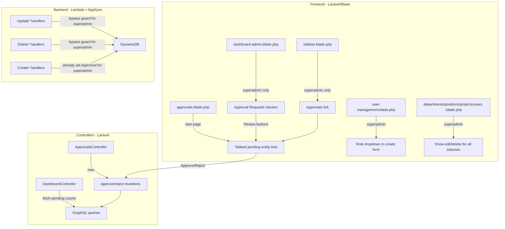

# Design Document: Superadmin Enhancements

## Overview

This feature differentiates the superadmin experience from the standard admin by adding:
1. An Approval Requests section on the superadmin dashboard showing pending entity counts
2. A dedicated "Approvals" sidebar link and page with tabbed entity review
3. Unrestricted edit/delete on all entities regardless of approval status (frontend + Lambda)
4. A role dropdown in the user creation form so superadmins can create admin-level users
5. Automatic "Approved" status on all entities created by superadmins (already partially implemented in Lambda handlers)

The changes span three layers: Laravel/Blade frontend, Laravel controllers, and Python Lambda handlers behind AWS AppSync.

## Architecture



### Change Summary by Layer

**Frontend (Blade templates + JS):**
- `sidebar.blade.php`: Add "Approvals" link inside the existing `@if($userType === 'superadmin')` block
- `dashboard-admin.blade.php`: Add Approval Requests card section when userType is superadmin
- New `approvals.blade.php`: Tabbed page listing pending projects, departments, positions with approve/reject actions
- `user-management.blade.php`: Swap read-only Role input for a dropdown when superadmin
- `departments.blade.php`, `positions.blade.php`, `projects.blade.php`, `user-management.blade.php`: Show edit/delete buttons for all approval statuses when superadmin

**Controllers (PHP):**
- `DashboardController::adminDashboard()`: Query pending counts for projects, departments, positions; pass to view
- New `ApprovalsController`: `index()` lists pending entities, proxies approve/reject calls to GraphQL

**Routes:**
- Add `GET /admin/approvals` and approve/reject POST routes under `role:superadmin` middleware (or reuse `role:admin` with in-controller guard)

**Lambda handlers (Python):**
- `UpdateDepartment`, `UpdatePosition`, `UpdateProject`, `UpdateUser`: Check `caller["userType"] == "superadmin"` before the approval_status guard — if superadmin, skip the guard
- `DeleteDepartment`, `DeletePosition`, `DeleteProject`, `DeleteUser`: Same superadmin bypass
- `CreateDepartment`, `CreatePosition`, `CreateProject`: Add `approval_status = "Approved" if caller["userType"] == "superadmin" else "Pending_Approval"` (same pattern already in CreateUser)

## Components and Interfaces

### 1. Sidebar Enhancement (`sidebar.blade.php`)

Inside the existing `@if($userType === 'superadmin')` block, add an "Approvals" nav item linking to `/admin/approvals`. Use the same nav-icon SVG pattern as other sidebar items. Highlight when `request()->is('admin/approvals*')`.

### 2. Dashboard Approval Requests Section (`dashboard-admin.blade.php`)

Conditionally rendered when `$userType === 'superadmin'`. Displays three cards (Projects, Departments, Positions) each showing a pending count and a "Review" link to `/admin/approvals`. Data comes from new view variables: `$pendingProjects`, `$pendingDepartments`, `$pendingPositions`.

### 3. DashboardController Changes

In `adminDashboard()`, when `$user['userType'] === 'superadmin'`, query LIST_DEPARTMENTS, LIST_POSITIONS, LIST_PROJECTS with no filter, then count items where `approval_status === 'Pending_Approval'` client-side. Pass counts to the view.

### 4. ApprovalsController (new)

```php
class ApprovalsController extends Controller
{
    public function index()       // GET /admin/approvals — fetch all pending entities, render tabbed view
    public function approve($type, $id)  // POST /admin/approvals/{type}/{id}/approve
    public function reject($type, $id)   // POST /admin/approvals/{type}/{id}/reject
}
```

The `approve` method maps `$type` to the correct GraphQL mutation (`approveDepartment`, `approvePosition`, `approveProject`). The `reject` method does the same but includes the `reason` argument.

### 5. Approvals Page (`approvals.blade.php`)

Three tabs: Projects, Departments, Positions. Each tab shows a table of pending entities with columns: Name, Code, Created Date, Created By, and action buttons (Approve, Reject). Reject opens a reason modal. Success/error toast notifications on action completion. JS handles tab switching and AJAX calls to the controller.

### 6. User Creation Role Dropdown (`user-management.blade.php`)

Replace the read-only Role `<input>` with a `<select>` when `$userType === 'superadmin'`:
```html
<select id="user-form-role">
    <option value="admin">Admin</option>
    <option value="user" selected>User</option>
</select>
```
The JS save handler includes the selected `userType` value in the POST body. For admin callers, keep the existing read-only input.

### 7. Unrestricted Edit/Delete on Frontend

In each management Blade template, change the condition that hides edit/delete buttons from:
```php
@if($approvalStatus !== 'Approved')
```
to:
```php
@if($approvalStatus !== 'Approved' || $userType === 'superadmin')
```

### 8. Lambda Handler Superadmin Bypass

For each Update*/Delete* handler, change the guard from:
```python
if existing.get("approval_status") == "Approved":
    raise ValueError("Cannot update/delete: approved entities cannot be edited/deleted")
```
to:
```python
if existing.get("approval_status") == "Approved" and caller["userType"] != "superadmin":
    raise ValueError("Cannot update/delete: approved entities cannot be edited/deleted")
```

### 9. Lambda Create Handlers — Auto-Approve

For `CreateDepartment`, `CreatePosition`, `CreateProject`, add the same pattern already in `CreateUser`:
```python
approval_status = "Approved" if caller["userType"] == "superadmin" else "Pending_Approval"
```

## Data Models

No new DynamoDB tables or schema changes required. All entities already have `approval_status` and `rejectionReason` fields.

### Existing Entity Fields Used

| Field | Type | Values |
|-------|------|--------|
| `approval_status` | String | `Pending_Approval`, `Approved`, `Rejected` |
| `rejectionReason` | String | Free text (set on reject) |
| `userType` | String | `superadmin`, `admin`, `user` |

### View Data (DashboardController → dashboard-admin.blade.php)

New variables passed to the superadmin dashboard view:
- `pendingProjects: int` — count of projects with `approval_status === 'Pending_Approval'`
- `pendingDepartments: int` — count of departments with `approval_status === 'Pending_Approval'`
- `pendingPositions: int` — count of positions with `approval_status === 'Pending_Approval'`

### View Data (ApprovalsController → approvals.blade.php)

- `pendingProjects: array` — list of project objects with `approval_status === 'Pending_Approval'`
- `pendingDepartments: array` — list of department objects with `approval_status === 'Pending_Approval'`
- `pendingPositions: array` — list of position objects with `approval_status === 'Pending_Approval'`


## Correctness Properties

*A property is a characteristic or behavior that should hold true across all valid executions of a system — essentially, a formal statement about what the system should do. Properties serve as the bridge between human-readable specifications and machine-verifiable correctness guarantees.*

### Property 1: Pending entity count accuracy

*For any* list of entities (projects, departments, or positions) with mixed approval statuses, the pending count displayed on the superadmin dashboard SHALL equal the number of entities whose `approval_status` is `"Pending_Approval"`.

**Validates: Requirements 1.4, 1.6**

### Property 2: Approvals link visibility restricted to superadmin

*For any* user with a `userType` that is not `"superadmin"`, the sidebar SHALL NOT contain an "Approvals" navigation link.

**Validates: Requirements 2.2, 2.5**

### Property 3: Approvals page filters to pending only

*For any* list of entities passed to the Approvals page, only entities with `approval_status === "Pending_Approval"` SHALL appear in the displayed list for each tab.

**Validates: Requirements 3.2**

### Property 4: Pending entity display contains required fields

*For any* pending entity displayed on the Approvals page, the rendered output SHALL contain the entity's name, code, created date, and created-by information.

**Validates: Requirements 3.3**

### Property 5: Approve mutation routing

*For any* entity type in `{project, department, position}`, clicking Approve SHALL invoke the corresponding mutation (`approveProject`, `approveDepartment`, `approvePosition`) with the correct entity ID.

**Validates: Requirements 3.6**

### Property 6: Approvals page access control

*For any* user with `userType` not equal to `"superadmin"`, requesting the Approvals page SHALL be denied (redirect or 403).

**Validates: Requirements 3.10**

### Property 7: Superadmin unrestricted update and delete

*For any* entity (user, department, position, project) with *any* `approval_status` value, when the caller's `userType` is `"superadmin"`, the Lambda update and delete handlers SHALL allow the operation to proceed without raising an approval_status error.

**Validates: Requirements 4.1, 4.2, 4.3**

### Property 8: Admin restricted on approved entities

*For any* entity with `approval_status === "Approved"`, when the caller's `userType` is `"admin"`, the Lambda update and delete handlers SHALL reject the operation with an error.

**Validates: Requirements 4.4, 4.5**

### Property 9: Superadmin-created entities are auto-approved

*For any* entity (user, department, position, project) created by a caller with `userType === "superadmin"`, the resulting `approval_status` SHALL be `"Approved"`.

**Validates: Requirements 6.1, 6.2, 6.3, 6.4**

### Property 10: Admin-created entities are pending

*For any* entity created by a caller with `userType === "admin"`, the resulting `approval_status` SHALL be `"Pending_Approval"`.

**Validates: Requirements 6.5**

## Error Handling

| Scenario | Layer | Handling |
|----------|-------|----------|
| GraphQL query fails when loading pending counts | DashboardController | Log warning, default counts to 0, render dashboard without approval section error |
| Approve/Reject mutation fails | ApprovalsController | Return JSON `{success: false, error: message}`, frontend shows error toast |
| Non-superadmin accesses `/admin/approvals` | Route middleware / Controller | Redirect to dashboard or return 403 |
| Lambda update/delete on approved entity by admin | Lambda handler | Raise `ValueError` with descriptive message, AppSync returns GraphQL error |
| Lambda update/delete on approved entity by superadmin | Lambda handler | Skip guard, proceed normally |
| CreateUser with invalid userType by superadmin | Lambda CreateUser | Existing `_validate_enum` raises `ValueError` — only `admin` and `user` are valid |
| Network error during approve/reject AJAX call | Frontend JS | Catch block shows "Network error" toast |

## Testing Strategy

### Unit Tests (pytest for Lambda, PHPUnit for Laravel)

- Test that `DashboardController::adminDashboard()` passes pending counts for superadmin and omits them for admin
- Test `ApprovalsController` returns 403/redirect for non-superadmin users
- Test approve/reject controller methods call correct GraphQL mutations
- Test Lambda update handlers allow superadmin to update Approved entities
- Test Lambda delete handlers allow superadmin to delete Approved entities
- Test Lambda update/delete handlers still reject admin on Approved entities
- Test Lambda create handlers set correct approval_status based on caller userType

### Property-Based Tests (Hypothesis for Python Lambda handlers)

Each property test runs a minimum of 100 iterations with randomized inputs.

- **Feature: superadmin-enhancements, Property 7: Superadmin unrestricted update and delete** — Generate random entities with random approval_status values, call update/delete with superadmin caller, assert no approval_status error raised
- **Feature: superadmin-enhancements, Property 8: Admin restricted on approved entities** — Generate random entities with approval_status "Approved", call update/delete with admin caller, assert ValueError raised
- **Feature: superadmin-enhancements, Property 9: Superadmin-created entities are auto-approved** — Generate random valid entity creation inputs with superadmin caller, assert resulting approval_status is "Approved"
- **Feature: superadmin-enhancements, Property 10: Admin-created entities are pending** — Generate random valid entity creation inputs with admin caller, assert resulting approval_status is "Pending_Approval"

Property-based testing library: **Hypothesis** (Python) for Lambda handler tests. Frontend properties (1–6) are validated through unit/integration tests in PHPUnit since they involve Blade rendering and controller logic.
