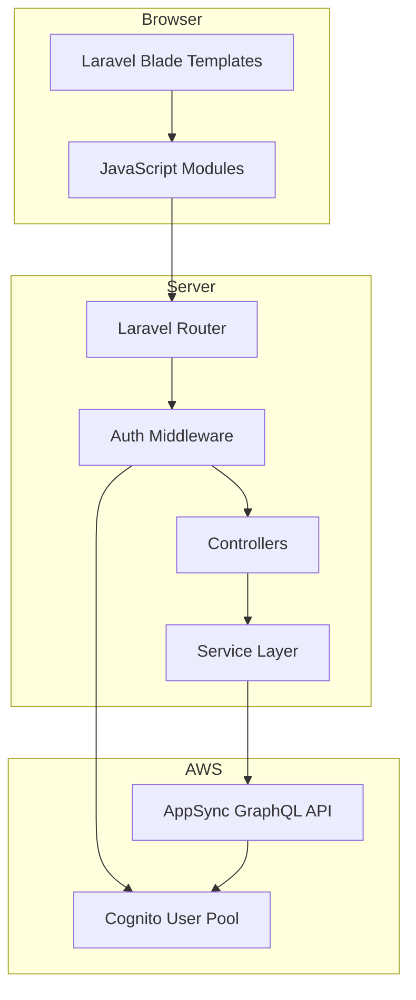
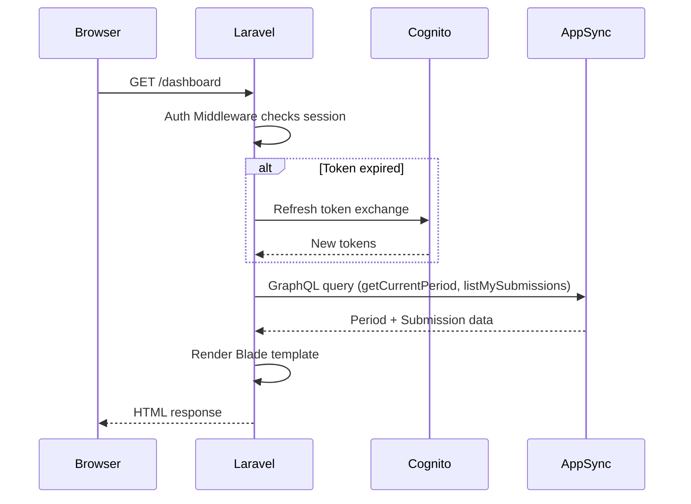
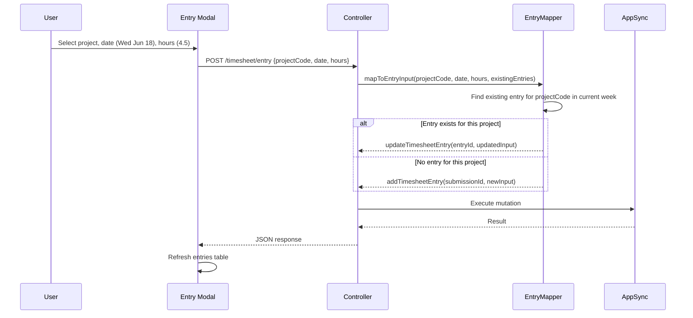

# Design Document: TimeFlow Frontend

## Overview

TimeFlow Frontend is a PHP/Laravel web application that serves as the employee-facing portal for the COLABS Employee Timesheet Management System. It resides in a `frontend/` directory at the workspace root and integrates with the existing AWS backend (AppSync GraphQL API, Cognito authentication).

The frontend provides:
- Authentication via AWS Cognito (email/password login, session management, password reset)
- Dashboard with summary cards, weekly activity chart, and recent entries
- Timesheet management: view, add, edit, and delete time entries for the current week
- Timesheet history with date range filtering
- Settings for profile management and password changes
- Role-based access control derived from Cognito token claims

### Key Design Challenge: Weekly Row Model vs. Per-Day UI

The backend `TimesheetEntry` model stores hours as a single row per project per week with day-of-week columns (`saturday`, `sunday`, `monday`, `tuesday`, `wednesday`, `thursday`, `friday`). However, the UI mockups show an "Add New Entry" modal with a single Date picker and Charged Hours input, presenting entries as individual date+project rows.

The frontend reconciles this by:
1. **Display**: Flattening each `TimesheetEntry` row into individual day rows (one row per day that has hours > 0) for the entries table
2. **Add/Edit**: When a user picks a date and hours, the frontend maps the date to the correct day-of-week field and either creates a new `TimesheetEntry` row (if no entry exists for that project in the current week) or updates the existing row's day field
3. **Delete**: Removing a single day's hours zeros out that day field on the entry row. If all days become zero, the entire entry row is removed via `removeTimesheetEntry`

This mapping layer is the core complexity of the frontend and lives in a dedicated service module.

## Architecture

### High-Level Architecture



### Architecture Decisions

1. **Laravel with Blade templates** over SPA framework: Matches the specified tech stack (HTML, CSS, PHP/Laravel). Blade provides server-side rendering with partial AJAX updates for interactive elements like modals and table refreshes.

2. **Server-side GraphQL calls** over client-side: The Laravel backend acts as a BFF (Backend-for-Frontend), making GraphQL calls server-side. This keeps the AppSync endpoint and tokens out of browser JavaScript, improving security.

3. **Cognito SDK via AWS SDK for PHP**: Authentication uses the `aws/aws-sdk-php` package to call Cognito's `InitiateAuth`, `RespondToAuthChallenge`, `ChangePassword`, and `ForgotPassword` APIs directly.

4. **Entry flattening service**: A dedicated `TimesheetEntryMapper` service handles the translation between the backend's weekly-row model and the UI's per-day display model. This isolates the mapping complexity from controllers and views.

5. **AJAX for modal interactions**: The Entry_Modal (add/edit) and delete confirmation use JavaScript fetch calls to Laravel API routes, which in turn call AppSync. This avoids full page reloads for CRUD operations.

6. **Session-based auth state**: Cognito tokens (ID, access, refresh) are stored in the Laravel session (server-side). The refresh token enables silent re-authentication for up to 30 days when "Remember this device" is checked.

### Request Flow



### Entry Mapping Flow



## Components and Interfaces

### 1. Authentication Component

**Files:** `app/Http/Controllers/AuthController.php`, `app/Services/CognitoAuthService.php`

**Responsibilities:**
- Login form rendering and credential submission
- Cognito `InitiateAuth` (USER_PASSWORD_AUTH flow)
- Token storage in Laravel session
- Refresh token handling for "Remember this device"
- Forgot password flow (ForgotPassword → ConfirmForgotPassword)
- Logout (session invalidation + Cognito GlobalSignOut)

**Interface:**
```
GET  /login              → Show login form
POST /login              → Authenticate via Cognito
POST /logout             → Invalidate session
GET  /forgot-password    → Show forgot password form
POST /forgot-password    → Initiate Cognito forgot password
POST /reset-password     → Confirm password reset with code
```

### 2. Auth Middleware

**File:** `app/Http/Middleware/CognitoAuth.php`

**Responsibilities:**
- Check for valid session tokens on every authenticated route
- Refresh expired access tokens using the refresh token
- Redirect to `/login` if no valid session exists
- Extract and cache user role claims (`custom:userType`, `custom:role`) from the ID token

### 3. Dashboard Controller

**File:** `app/Http/Controllers/DashboardController.php`

**Responsibilities:**
- Fetch current period via `getCurrentPeriod`
- Fetch current submission via `listMySubmissions(filter: {periodId})`
- Compute deadline countdown (days, hours, minutes until `submissionDeadline`)
- Prepare weekly activity chart data (Mon–Fri hours from entries)
- Prepare recent entries list (flattened from weekly rows)

**Interface:**
```
GET /dashboard → Render dashboard page
```

### 4. Timesheet Controller

**File:** `app/Http/Controllers/TimesheetController.php`

**Responsibilities:**
- Display current week entries (flattened view)
- Handle add/edit/delete entry operations via AJAX routes
- Search and filter entries by project code or description

**Interface:**
```
GET    /timesheet              → Render timesheet page
POST   /timesheet/entry        → Add new entry (AJAX)
PUT    /timesheet/entry/{id}   → Update entry (AJAX)
DELETE /timesheet/entry/{id}   → Delete entry (AJAX)
GET    /timesheet/projects     → List approved projects (AJAX, for dropdown)
```

### 5. History Controller

**File:** `app/Http/Controllers/HistoryController.php`

**Responsibilities:**
- Fetch all past submissions via `listMySubmissions`
- Filter by date range
- Flatten entries for display

**Interface:**
```
GET /timesheet/history → Render history page
GET /timesheet/history/filter → Filter by date range (AJAX)
```

### 6. Settings Controller

**File:** `app/Http/Controllers/SettingsController.php`

**Responsibilities:**
- Fetch user profile via `getUser`
- Fetch departments via `listDepartments`
- Handle avatar upload
- Handle password change via Cognito `ChangePassword` API

**Interface:**
```
GET  /settings              → Render settings page
POST /settings/avatar       → Upload avatar (AJAX)
POST /settings/password     → Change password (AJAX)
```

### 7. GraphQL Client Service

**File:** `app/Services/GraphQLClient.php`

**Responsibilities:**
- Centralized HTTP client for AppSync GraphQL endpoint
- Attach Cognito JWT access token to Authorization header
- Handle GraphQL error responses
- Retry logic for transient network failures
- Detect 401/403 and trigger re-authentication

**Interface:**
```php
class GraphQLClient {
    public function query(string $query, array $variables = []): array;
    public function mutate(string $mutation, array $variables = []): array;
}
```

### 8. TimesheetEntryMapper Service

**File:** `app/Services/TimesheetEntryMapper.php`

**Responsibilities:**
- Flatten weekly entry rows into per-day display rows
- Map a date + hours input to the correct day-of-week field
- Determine whether to create or update an entry row
- Build `TimesheetEntryInput` objects for GraphQL mutations
- Calculate weekly totals from entry rows

**Interface:**
```php
class TimesheetEntryMapper {
    public function flattenEntries(array $entries, string $weekStartDate): array;
    public function mapToEntryInput(string $projectCode, string $date, float $hours, array $existingEntries): array;
    public function calculateWeeklyTotal(array $entries): float;
    public function calculateDailyTotals(array $entries): array;
}
```

### 9. Blade View Components

**Shared Components:**
- `layouts/app.blade.php` — Main layout with sidebar
- `components/sidebar.blade.php` — Navigation sidebar
- `components/entry-modal.blade.php` — Add/Edit entry modal
- `components/summary-card.blade.php` — Dashboard summary card
- `components/countdown.blade.php` — Deadline countdown badge

**Page Templates:**
- `pages/login.blade.php`
- `pages/dashboard.blade.php`
- `pages/timesheet.blade.php`
- `pages/history.blade.php`
- `pages/settings.blade.php`

## Data Models

### Frontend Data Structures

#### FlattenedEntry (Display Model)
Represents a single day's hours for display in the UI table:
```
{
    entryId: string,          // Original TimesheetEntry ID
    date: string,             // ISO date (e.g., "2026-06-18")
    dayOfWeek: string,        // e.g., "wednesday"
    projectCode: string,
    description: string,      // Project name from project lookup
    chargedHours: float,      // Hours for this specific day
    isEditable: boolean       // false when submission status is "Submitted"
}
```

#### EntryFormData (Modal Input Model)
Data collected from the Entry_Modal form:
```
{
    projectCode: string,
    description: string,
    date: string,             // ISO date selected by user
    chargedHours: float       // Non-negative, max 2 decimal places
}
```

#### DashboardData (Dashboard View Model)
```
{
    userName: string,
    period: {
        startDate: string,
        endDate: string,
        periodString: string,
        submissionDeadline: string
    },
    countdown: {
        days: int,
        hours: int,
        minutes: int
    },
    totalHours: float,
    dailyHours: {             // For weekly activity chart
        monday: float,
        tuesday: float,
        wednesday: float,
        thursday: float,
        friday: float
    },
    recentEntries: FlattenedEntry[]
}
```

#### UserSession (Session Model)
```
{
    userId: string,
    email: string,
    fullName: string,
    userType: string,         // "superadmin" | "admin" | "user"
    role: string,             // "Project_Manager" | "Tech_Lead" | "Employee"
    departmentId: string,
    accessToken: string,
    idToken: string,
    refreshToken: string,
    tokenExpiry: int           // Unix timestamp
}
```

### Entry Mapping Rules

| User Action | Backend Operation |
|---|---|
| Add entry: project has no existing row this week | `addTimesheetEntry` with hours on the selected day, zeros on other days |
| Add entry: project already has a row this week | `updateTimesheetEntry` adding hours to the selected day field |
| Edit entry: change hours for a day | `updateTimesheetEntry` with updated day field |
| Edit entry: change date (same project) | `updateTimesheetEntry` zeroing old day, setting new day |
| Delete entry: other days still have hours | `updateTimesheetEntry` zeroing the selected day field |
| Delete entry: last day with hours | `removeTimesheetEntry` to delete the entire row |

### Configuration

**File:** `frontend/.env`
```
APPSYNC_ENDPOINT=https://{api-id}.appsync-api.ap-southeast-1.amazonaws.com/graphql
COGNITO_USER_POOL_ID=ap-southeast-1_{poolId}
COGNITO_CLIENT_ID={clientId}
AWS_REGION=ap-southeast-1
APP_NAME=TimeFlow
```
