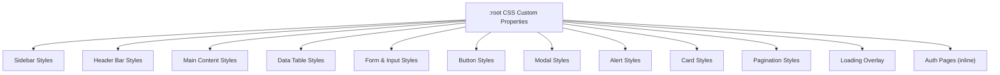

# Design Document: UI Style Overhaul

## Overview

This design covers the complete visual restyling of the TimeFlow frontend from a dark-themed UI to a modern, light-themed SaaS admin dashboard. The overhaul is CSS-only with one new HTML component (Header Bar). No backend, routing, or functional logic changes are required.

The approach centers on:
1. Replacing hardcoded color values with CSS custom properties (design tokens) on `:root`
2. Rewriting `frontend/public/css/app.css` in-place to reference those tokens with light-theme values
3. Adding a new `header-bar` partial to `layouts/app.blade.php`
4. Updating the login page's inline `<style>` block to match the light theme
5. No new CSS files, no build tool changes, no preprocessor introduction

## Architecture

### CSS Architecture: Single-File Token-Based Approach

The current architecture uses a single `frontend/public/css/app.css` file with hardcoded hex colors. The new architecture keeps this single-file approach but introduces CSS custom properties at the `:root` level.



### Layout Architecture Change

Current layout:
```
┌──────────┬─────────────────────────┐
│          │                         │
│ Sidebar  │     Main Content        │
│  260px   │      flex: 1            │
│          │                         │
└──────────┴─────────────────────────┘
```

New layout (adds Header Bar):
```
┌──────────┬─────────────────────────┐
│          │  Header Bar (sticky)    │
│ Sidebar  ├─────────────────────────┤
│  260px   │                         │
│          │     Main Content        │
│          │      flex: 1            │
│          │                         │
└──────────┴─────────────────────────┘
```

### File Modification Summary

| File | Change Type |
|------|-------------|
| `frontend/public/css/app.css` | Major rewrite — all color values replaced with tokens, new sections added |
| `frontend/resources/views/layouts/app.blade.php` | Add Header Bar include, wrap main-content in a flex-column container |
| `frontend/resources/views/components/header-bar.blade.php` | **New file** — Header Bar partial |
| `frontend/resources/views/pages/login.blade.php` | Update inline `<style>` block to light theme |
| `frontend/resources/views/pages/forgot-password.blade.php` | Update inline `<style>` block to light theme |
| `frontend/resources/views/pages/reset-password.blade.php` | Update inline `<style>` block to light theme |
| `frontend/resources/views/pages/force-change-password.blade.php` | Update inline `<style>` block to light theme |

No Blade template structural changes are needed for pages, components, tables, cards, modals, or forms — the existing CSS class names are preserved and restyled.

## Components and Interfaces

### 1. Design Tokens (CSS Custom Properties)

All tokens defined on `:root` in `app.css`:

```css
:root {
    /* Primary */
    --color-primary: #2563eb;
    --color-primary-hover: #1d4ed8;
    --color-primary-light: rgba(37, 99, 235, 0.1);

    /* Sidebar */
    --color-sidebar-bg: #1e3a5f;
    --color-sidebar-text: #ffffff;
    --color-sidebar-active-bg: rgba(255, 255, 255, 0.12);
    --color-sidebar-hover-bg: rgba(255, 255, 255, 0.06);

    /* Surfaces & Backgrounds */
    --color-body-bg: #f1f5f9;
    --color-surface: #ffffff;
    --color-surface-hover: #f8fafc;

    /* Text */
    --color-text-primary: #1e293b;
    --color-text-secondary: #64748b;

    /* Borders */
    --color-border: #e2e8f0;

    /* Danger */
    --color-danger: #dc2626;
    --color-danger-hover: #b91c1c;

    /* Border Radius */
    --radius-sm: 6px;
    --radius-md: 8px;
    --radius-lg: 12px;

    /* Shadows */
    --shadow-sm: 0 1px 2px rgba(0, 0, 0, 0.05);
    --shadow-md: 0 4px 12px rgba(0, 0, 0, 0.1);

    /* Typography */
    --font-family: 'Inter', -apple-system, BlinkMacSystemFont, 'Segoe UI', Roboto, sans-serif;
    --font-size-base: 14px;
    --line-height-base: 1.5;
}
```

### 2. Header Bar Component (New)

**File:** `frontend/resources/views/components/header-bar.blade.php`

```html
<header class="header-bar" role="banner">
    <div class="header-bar-left">
        <!-- Placeholder for breadcrumbs or page context -->
    </div>
    <div class="header-bar-right">
        <div class="header-search">
            <svg class="header-icon" viewBox="0 0 24 24" fill="none" stroke="currentColor"
                 stroke-width="2" stroke-linecap="round" stroke-linejoin="round" aria-hidden="true">
                <circle cx="11" cy="11" r="8"></circle>
                <line x1="21" y1="21" x2="16.65" y2="16.65"></line>
            </svg>
        </div>
        <button class="header-notification" aria-label="Notifications">
            <svg class="header-icon" viewBox="0 0 24 24" fill="none" stroke="currentColor"
                 stroke-width="2" stroke-linecap="round" stroke-linejoin="round" aria-hidden="true">
                <path d="M18 8A6 6 0 0 0 6 8c0 7-3 9-3 9h18s-3-2-3-9"></path>
                <path d="M13.73 21a2 2 0 0 1-3.46 0"></path>
            </svg>
        </button>
        <div class="header-user">
            <div class="header-user-avatar" aria-hidden="true">
                {{ strtoupper(substr(session('user.fullName', 'U'), 0, 1)) }}
            </div>
            <span class="header-user-name">{{ session('user.fullName', 'User') }}</span>
        </div>
    </div>
</header>
```

**CSS for Header Bar:**

```css
.header-bar {
    display: flex;
    align-items: center;
    justify-content: space-between;
    padding: 0 1.5rem;
    height: 56px;
    background: var(--color-surface);
    border-bottom: 1px solid var(--color-border);
    box-shadow: var(--shadow-sm);
    position: sticky;
    top: 0;
    z-index: 50;
}

.header-bar-right {
    display: flex;
    align-items: center;
    gap: 1rem;
}

.header-icon {
    width: 20px;
    height: 20px;
    color: var(--color-text-secondary);
    cursor: pointer;
    transition: color 0.2s;
}

.header-icon:hover {
    color: var(--color-text-primary);
}

.header-notification {
    background: none;
    border: none;
    padding: 0.375rem;
    border-radius: var(--radius-sm);
    cursor: pointer;
    display: flex;
    align-items: center;
}

.header-notification:hover {
    background: var(--color-surface-hover);
}

.header-user {
    display: flex;
    align-items: center;
    gap: 0.5rem;
}

.header-user-avatar {
    width: 32px;
    height: 32px;
    background: var(--color-primary);
    border-radius: 50%;
    display: flex;
    align-items: center;
    justify-content: center;
    font-size: 0.8rem;
    font-weight: 600;
    color: #fff;
}

.header-user-name {
    font-size: 0.875rem;
    font-weight: 500;
    color: var(--color-text-primary);
}
```

### 3. Updated Layout Structure

**`layouts/app.blade.php`** changes:

```html
<div class="app-layout">
    @include('components.sidebar')
    <div class="content-wrapper">
        @include('components.header-bar')
        <main class="main-content" role="main">
            @yield('content')
        </main>
    </div>
</div>
```

New `.content-wrapper` CSS:
```css
.content-wrapper {
    flex: 1;
    margin-left: 260px;
    display: flex;
    flex-direction: column;
    min-height: 100vh;
}

.main-content {
    flex: 1;
    padding: 1.5rem;
    /* margin-left removed — handled by content-wrapper */
}
```

### 4. Component Style Specifications

#### Sidebar
- Background: `var(--color-sidebar-bg)` (#1e3a5f)
- Text: `var(--color-sidebar-text)` (#ffffff)
- Container: `border-radius: var(--radius-lg)` with 8px margin from viewport edges
- Active link: `background: var(--color-sidebar-active-bg)`, left 3px border accent in white
- Hover: `background: var(--color-sidebar-hover-bg)`
- Brand border, footer border: `rgba(255, 255, 255, 0.12)`
- Nav group chevron: white, rotates 180° on open
- User role text: `rgba(255, 255, 255, 0.6)`

#### Data Tables
- Container: `background: var(--color-surface)`, `border-radius: var(--radius-lg)`, `box-shadow: var(--shadow-sm)`
- Header row: `background: var(--color-surface-hover)` (#f8fafc), `color: var(--color-text-secondary)`, uppercase 0.75rem
- Body rows: white background, `border-bottom: 1px solid var(--color-border)`
- Hover: `background: var(--color-surface-hover)`
- Remove alternating row colors (even/odd)
- Action buttons: outlined style with `border-radius: var(--radius-sm)`, color-coded borders

#### Summary Cards
- Background: `var(--color-surface)`, `border-radius: var(--radius-lg)`, `box-shadow: var(--shadow-sm)`
- Icon circle: `background: var(--color-primary-light)`, `color: var(--color-primary)`
- Title: `color: var(--color-text-secondary)`, 0.8rem
- Value: `color: var(--color-text-primary)`, 1.25rem bold
- Remove dark border, use shadow instead

#### Buttons
- Primary: `background: var(--color-primary)`, white text, `border-radius: var(--radius-md)`, `box-shadow: var(--shadow-sm)`
- Outlined: transparent bg, `border: 1px solid var(--color-primary)`, primary text
- Danger: `background: var(--color-danger)`, white text
- Danger-outlined: transparent bg, red border, red text
- Hover: darken by 10% (use `--color-primary-hover` / `--color-danger-hover`)
- Disabled: `opacity: 0.5`, `cursor: not-allowed`

#### Forms
- Inputs: `background: var(--color-surface)`, `border: 1px solid var(--color-border)`, `color: var(--color-text-primary)`
- Focus: `border-color: var(--color-primary)`, `box-shadow: 0 0 0 3px var(--color-primary-light)`
- Labels: `color: var(--color-text-secondary)`, 0.8rem, font-weight 500
- Error: `border-color: var(--color-danger)`, red error text

#### Modals
- Background: `var(--color-surface)`, `border-radius: var(--radius-lg)`, `box-shadow: var(--shadow-md)`
- Overlay: `rgba(0, 0, 0, 0.4)`
- Header: text-primary title, close button, bottom border
- Open animation: fade + scale-up 200ms ease
- Remove dark border

#### Alerts
- Success: bg `#f0fdf4`, border `#bbf7d0`, text `#166534`
- Error: bg `#fef2f2`, border `#fecaca`, text `#991b1b`
- Warning: bg `#fffbeb`, border `#fde68a`, text `#92400e`
- Info: bg `#eff6ff`, border `#bfdbfe`, text `#1e40af`

#### Tab Navigation
- Items: `color: var(--color-text-secondary)`, 0.875rem, font-weight 500
- Active: `color: var(--color-primary)`, `border-bottom: 2px solid var(--color-primary)`
- Hover: `color: var(--color-text-primary)`
- Padding: 1rem horizontal, 1.25rem bottom margin

#### Pagination
- Buttons: `background: var(--color-surface)`, `border: 1px solid var(--color-border)`, `border-radius: var(--radius-md)`
- Active: `background: var(--color-primary)`, white text
- Hover: `border-color: var(--color-primary)`

#### Loading Overlay
- Background: `rgba(255, 255, 255, 0.7)`
- Spinner border: `var(--color-border)`, accent `var(--color-primary)`
- Text: `color: var(--color-text-secondary)`

#### Auth Pages (Login, Forgot Password, Reset Password, Force Change Password)
- Body: `background: var(--color-body-bg)` (flat, no gradient)
- Card: `background: var(--color-surface)`, `border-radius: var(--radius-lg)`, `box-shadow: var(--shadow-md)`, padding 2rem
- Logo text: `color: var(--color-text-primary)`
- Submit button: full-width primary style
- Error alert: red-tinted as per alert styles

#### Skeleton Loading
- Gradient: light gray shimmer (`#e2e8f0` → `#f1f5f9` → `#e2e8f0`)

#### Badges
- Keep pill shape, update to light-theme tints:
  - Success: bg `#f0fdf4`, text `#166534`
  - Warning: bg `#fffbeb`, text `#92400e`
  - Info: bg `#eff6ff`, text `#1e40af`
  - Danger: bg `#fef2f2`, text `#991b1b`

#### Charts
- Container: `background: var(--color-surface)`, `border-radius: var(--radius-lg)`, `box-shadow: var(--shadow-sm)`
- Bar color: `var(--color-primary)`
- Labels: `color: var(--color-text-secondary)`
- Values: `color: var(--color-text-primary)`

#### Breadcrumbs
- Text: `color: var(--color-text-secondary)`
- Links: `color: var(--color-primary)`
- Current: `color: var(--color-text-primary)`

#### Progress Bars
- Track: `var(--color-border)` (#e2e8f0)
- Keep green/yellow/red fill colors

#### Totals Row
- Border-top: `2px solid var(--color-border)`
- Background: `var(--color-primary-light)`
- Text: `color: var(--color-text-primary)`, font-weight 700

### 5. Responsive Behavior

**Below 768px:**
- Sidebar collapses off-screen (existing behavior preserved)
- `.content-wrapper` removes `margin-left: 260px`
- Header Bar adapts: hide user name, keep icons
- Summary cards: single column
- Data tables: horizontal scroll wrapper
- Filter bar: vertical stack, full-width inputs

**768px – 1023px (Tablet):**
- Sidebar: 200px width
- `.content-wrapper` adjusts `margin-left: 200px`
- Summary cards: 2-column grid

## Data Models

No data model changes. This is a purely visual overhaul — no backend, API, database, or state management changes are required.

## Correctness Properties

*A property is a characteristic or behavior that should hold true across all valid executions of a system — essentially, a formal statement about what the system should do. Properties serve as the bridge between human-readable specifications and machine-verifiable correctness guarantees.*

Since this feature is a purely visual CSS/HTML overhaul with no business logic, data transformations, or algorithmic behavior, the vast majority of acceptance criteria are concrete example checks (verifying specific CSS property values on specific selectors). Only one criterion is universally quantified across a collection.

### Property 1: Design token completeness and correctness

*For any* design token specified in Requirement 1.1 (primary color, primary-hover, sidebar background, sidebar text, body background, surface background, text-primary, text-secondary, border color, border-radius-sm, border-radius-md, border-radius-lg, shadow-sm, shadow-md, font-family), the `:root` block in `app.css` must define a CSS custom property with the specified value.

**Validates: Requirements 1.1**

### Property 2: All component color references use design tokens

*For any* CSS rule in `app.css` that sets a color, background, border-color, or box-shadow property on a component selector (excluding `:root`, alert-specific literal colors, and badge-specific literal colors), the value must reference a `var(--...)` custom property rather than a hardcoded hex or rgba value.

**Validates: Requirements 1.1, 1.4**

Note: The remaining acceptance criteria (2.1–2.8, 3.1–3.3, 4.1–4.3, 5.1–5.6, 6.1–6.6, 7.1–7.3, 8.1–8.5, 9.1–9.4, 10.1–10.4, 11.1–11.4, 12.1–12.4, 13.1–13.4, 14.1–14.4, 15.1–15.3) are all concrete example checks — each verifies specific CSS property values on specific selectors. These are best validated as unit/example tests rather than property-based tests, since they do not involve universal quantification over generated inputs.

## Error Handling

This feature involves no runtime error handling changes. The overhaul is purely presentational CSS and static HTML.

Potential issues and mitigations:

| Scenario | Mitigation |
|----------|------------|
| CSS custom property not supported (very old browser) | The font-family stack includes system fallbacks. CSS custom properties are supported in all modern browsers (Chrome 49+, Firefox 31+, Safari 9.1+, Edge 15+). No polyfill needed. |
| Missing `header-bar.blade.php` include | The `@include` directive will throw a Blade compilation error if the file is missing. This is caught at deploy/build time. |
| Auth pages still reference old inline styles | Each auth page's inline `<style>` block must be updated independently. A visual regression test or manual review covers this. |
| CSS specificity conflicts after token migration | All existing class names are preserved. Token-based values replace hardcoded values at the same specificity level, so no conflicts arise. |

## Testing Strategy

### Dual Testing Approach

This feature uses both unit tests and property-based tests, though the balance heavily favors unit/example tests given the visual nature of the work.

### Unit Tests (Primary)

Unit tests verify specific CSS property values on specific selectors. Each test parses the CSS file and asserts expected values.

Recommended test cases:
- **Design tokens exist**: Parse `:root` and verify all 18+ custom properties are defined with correct values
- **Body base styles**: Verify body uses `var(--color-body-bg)`, font-size 14px, line-height 1.5
- **Sidebar styles**: Verify `.sidebar` background, width, border-radius, active/hover states
- **Header bar styles**: Verify `.header-bar` background, border, shadow, sticky positioning
- **Data table styles**: Verify `.data-table` surface background, header row colors, hover state, no alternating rows
- **Summary card styles**: Verify `.summary-card` surface background, shadow, icon circle colors
- **Button styles**: Verify `.btn-primary`, `.btn-secondary`, `.btn-danger` colors, hover states, disabled state
- **Form styles**: Verify input background, border, focus state, label colors, error state
- **Modal styles**: Verify `.modal` surface background, overlay opacity, animation
- **Alert styles**: Verify all four alert variants (success, error, warning, info) with correct tinted backgrounds
- **Tab navigation**: Verify active tab border, hover color
- **Pagination**: Verify active page button primary background
- **Loading overlay**: Verify white overlay background, primary spinner color
- **Auth pages**: Verify login card uses light background, white surface, shadow-md
- **Responsive breakpoints**: Verify sidebar collapse, single-column cards, table scroll at 768px
- **Header bar template**: Verify `header-bar.blade.php` contains search icon, notification button, user avatar, user name elements

### Property-Based Tests

Property-based tests use a CSS parser library to validate universal properties across the stylesheet.

**Library**: Use a CSS parsing library (e.g., `css-tree` for Node.js or a Python CSS parser for pytest) to parse `app.css` and run assertions.

**Configuration**: Minimum 100 iterations per property test.

**Property Test 1**: Design token completeness and correctness
- Tag: **Feature: ui-style-overhaul, Property 1: Design token completeness — for any specified token, it must exist in :root with the correct value**
- Generate: iterate over the full list of specified token name/value pairs
- Assert: each token exists in the parsed `:root` rule with the expected value

**Property Test 2**: Component color references use design tokens
- Tag: **Feature: ui-style-overhaul, Property 2: Token usage — for any component CSS rule setting color/background/border-color, the value must reference a var(--...) custom property**
- Generate: iterate over all CSS rules in the parsed stylesheet (excluding `:root`, alert literals, badge literals)
- Assert: color-related property values reference `var(--...)` rather than hardcoded hex/rgba

### Visual Regression Testing (Recommended, not automated in CI)

Since this is a visual overhaul, manual or screenshot-based visual regression testing is strongly recommended:
- Compare before/after screenshots of each page
- Verify on desktop (1440px), tablet (768px), and mobile (375px) viewports
- Check both light theme consistency and responsive breakpoint behavior
